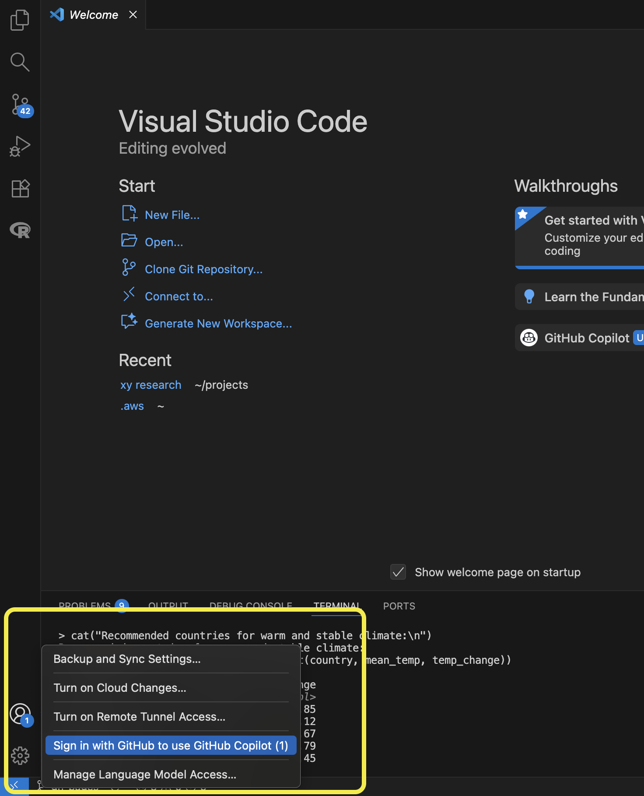

#### Download and install

1. Navigate to the [VS Code download page](https://code.visualstudio.com/download) and download the correct installer
2. Launch the installer and walk through the steps to install VS Code 

#### Set up in VS Code

3. Navigate to the VS Code Extension Marketplace and install [REditorSupport](https://marketplace.visualstudio.com/items?itemName=REditorSupport.r)

4. Open a new text file
5. Change the text file language to R in the Select Language Mode menu (control in bottom right) or by clicking on "select a language" in the text file   

6. VS Code will prompt you to install `languageserver`; agree to the prompt

  

#### Connect to Github

7. Create a [Github](https://github.com/) account

8. Connect your Github account to VS Code

