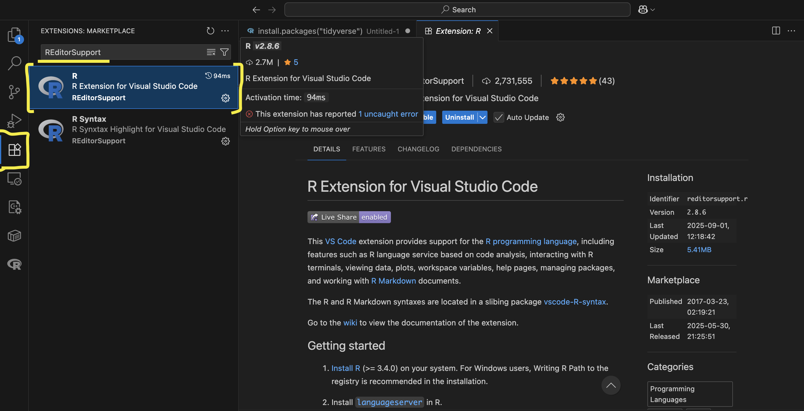
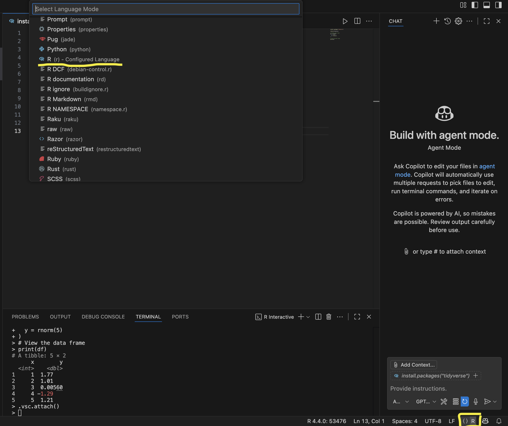

- Navigate to the [VS Code download page](https://code.visualstudio.com/download) and download the correct installer
- Launch the installer and walk through the steps to install VS Code
- Open VS Code, navigate to the VS Code Extension Marketplace, and install [REditorSupport](https://marketplace.visualstudio.com/items?itemName=REditorSupport.r)

- Open a new text file
- Change the text file language to R in the Select Language Mode menu (link in botton right)

- VS Code will prompt you to install `languageserver`; agree to the prompt

