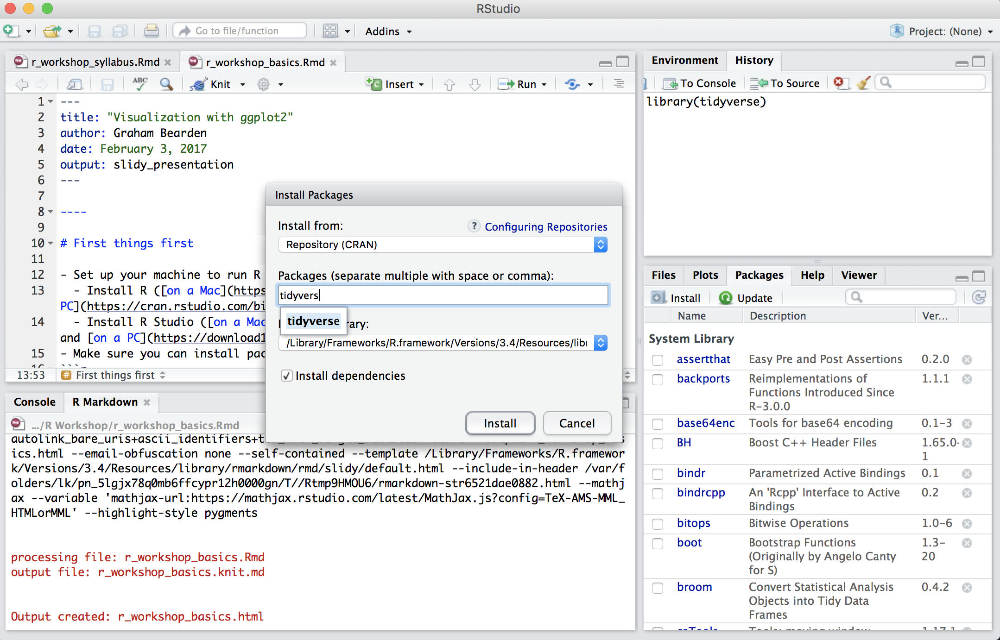

class: inverse, middle, center

# Getting Started

```{r setup, include=FALSE}
library(tidyverse)
library(knitr)
library(countdown)
options(scipen=999)

opts_chunk$set(warning=FALSE, message=FALSE)

airbnb <- read_csv('https://bit.ly/3oadz2L', col_types = cols())
climate <- read_csv('https://bit.ly/3kKErEb', col_types = cols())
```

---

# Set Up

- Set up your machine to run R
  - Install R ([on a Mac](https://cloud.r-project.org/bin/macosx/base/R-4.1.1.pkg) and [on a PC](https://cran.r-project.org/bin/windows/base/R-4.1.1-win.exe))
  - Install RStudio ([on a Mac](https://download1.rstudio.org/desktop/macos/RStudio-1.4.1717.dmg) and [on a PC](https://download1.rstudio.org/desktop/windows/RStudio-1.4.1717.exe))

---

# Defining R and the R Programmer 

- Typical uses for R
  - Data analysis
  - Data visualization
  - Reshaping data
  - Automation
- Mental models and programming
  - Excel/SPSS/Stata --> computational programming tools like R
- What all R programmers do
  - Google for answers
  - Borrow code
  - Ask friends and pros for help
- Useful references (see Reference Materials in the [syllabus](https://gbearden.github.io/r_course_evans_school/) for more)
  - help()
  - ??
  - [R Bloggers](https://www.r-bloggers.com/)
  - [stackoverflow](https://stackoverflow.com/questions/tagged/r)

---

# Quick Tour of R Studio

- Open and save (locally) an R Notebook  
- Run code from the notebook and the console  
- Make sure you can install packages
  - 2 ways to install packages
    - Command line/Console
    - R Studio GUI

--

```r
install.packages('tidyverse')
```

---

# Quick Tour of R Studio

- Open and save (locally) an R Notebook  
- Run code from the notebook and the console  
- Make sure you can install packages
  - 2 ways to install packages
    - Command line/Console
    - R Studio GUI



--- 
class: inverse, middle, center

# Libraries, functions, data

---

# <span style='color:#6DA34D'>Libraries</span>, functions, data

- Libraries (or packages) are collections of functions (and datasets)
- Over 10,000 libraries on CRAN

```r
install.packages('tidyverse')
library(tidyverse)
```

---

# Libraries, <span style='color:#6DA34D'>functions</span>, data

- Functions perform operations in R
```r
foo <- c(1,2,4)
min(foo)
mean(foo)
max(foo)
sd(foo)
```

---

# Libraries, <span style='color:#6DA34D'>functions</span>, data

- Functions perform operations in R
```{r, echo = TRUE, collapse=TRUE}
foo <- c(1,2,4)
min(foo)
mean(foo)
max(foo)
sd(foo)
```

---

# Libraries, <span style='color:#6DA34D'>functions</span>, data

- Function arguments
  - Let's look at arguments in the `lm` and `min` functions  
  - Arguments are function inputs that tell your function "how" and "to what" and state conditions for operations
  - Arguments are comma separated

```r
help(lm)
help(min)

cat_function <- function(love = TRUE){
  # SOURCE: https://hilaryparker.com/category/data-analysis/
  
  if(love == TRUE){
      print('I love cats!')
  }
  else {
      print('I am not a cool person.') 
  }
}
```

---

# Libraries, <span style='color:#6DA34D'>functions</span>, data

- Function arguments
  - Let's look at arguments in the `lm` and `min` functions  
  - Arguments are function inputs that tell your function "how" and "to what" and state conditions for operations
  - Arguments are comma separated

```r
foo <- c(1, 2, NA, 4)
min(foo)
mean(foo)
max(foo)
sd(foo)
```

---

# Libraries, <span style='color:#6DA34D'>functions</span>, data

- Function arguments
  - Let's look at arguments in the `lm` and `min` functions  
  - Arguments are function inputs that tell your function "how" and "to what" and state conditions for operations
  - Arguments are comma separated

```{r, echo = TRUE, collapse=TRUE}
foo <- c(1,2,NA, 4)
min(foo)
mean(foo)
max(foo)
sd(foo)
```

---

# Libraries, <span style='color:#6DA34D'>functions</span>, data

- Function arguments
  - Let's look at arguments in the `lm` and `min` functions  
  - Arguments are function inputs that tell your function "how" and "to what" and state conditions for operations
  - Arguments are comma separated

```{r, echo = TRUE, collapse=TRUE}
foo <- c(1,2,NA, 4)
min(foo, na.rm = TRUE)
mean(foo, na.rm = TRUE)
max(foo, na.rm = TRUE)
sd(foo, na.rm = TRUE)
```

---

# Libraries, functions, <span style='color:#6DA34D'>data</span>

- Data type is an important concept in all types of programming
  - Creates a set of parameters for functions applied to data
- Data types  
  - Vectors, tibbles, data frames, matrices
  - Integers, numbers, characters, factors
  
--

Confirm data type

```r
class(c('Washington', 'Oregon', 'Idaho'))
is.character(c('Washington', 'Oregon', 'Idaho'))
is.factor(c('Washington', 'Oregon', 'Idaho'))
```

--

Coerce data type

```r
as.factor(c('Washington', 'Oregon', 'Idaho'))
class(as.factor(c('Washington', 'Oregon', 'Idaho')))
```

---

# Libraries, functions, <span style='color:#6DA34D'>data</span>

- Data type is an important concept in all types of programming
  - Creates a set of parameters for functions applied to data
- Data types  
  - Vectors, tibbles, data frames, matrices  
  - Integers, numbers, characters, factors
  
Confirm data type

```{r, echo = TRUE, collapse=TRUE}
class(c('Washington', 'Oregon', 'Idaho'))
is.character(c('Washington', 'Oregon', 'Idaho'))
is.factor(c('Washington', 'Oregon', 'Idaho'))
```

Coerce data type

```r
as.factor(c('Washington', 'Oregon', 'Idaho'))
class(as.factor(c('Washington', 'Oregon', 'Idaho')))
```

---

# Libraries, functions, <span style='color:#6DA34D'>data</span>

- Data type is an important concept in all types of programming
  - Creates a set of parameters for functions applied to data
- Data types  
  - Vectors, tibbles, data frames, matrices  
  - Integers, numbers, characters, factors
  
Confirm data type

```{r, echo = TRUE, collapse=TRUE}
class(c('Washington', 'Oregon', 'Idaho'))
is.character(c('Washington', 'Oregon', 'Idaho'))
is.factor(c('Washington', 'Oregon', 'Idaho'))
```

Coerce data type

```{r, echo = TRUE, collapse=TRUE}
as.factor(c('Washington', 'Oregon', 'Idaho'))
class(as.factor(c('Washington', 'Oregon', 'Idaho')))
```

---

# Libraries, functions, <span style='color:#6DA34D'>data</span> 

- Data types  
  -  **Vectors**, tibbles, data frames, matrices  
- Vectors contain 1 or more values in a string  
- Call a specific element by its location in a vector  
```{r, echo = TRUE, collapse=TRUE}
c('Washington', 'Oregon', 'Idaho')
1:10
rep(1:2, times = 2)
seq(from = 0, to = 100, by = 10)
```

---

# Libraries, functions, <span style='color:#6DA34D'>data</span>

- Data types  
  - **Vectors**, tibbles, data frames, matrices  
- Vectors contain 1 or more values in a string  
- Call a specific element by its location in a vector  

```r
c('Washington', 'Oregon', 'Idaho')[2]
seq(from = 0, to = 100, by = 10)[6]
```

---

# Libraries, functions, <span style='color:#6DA34D'>data</span>

- Data types  
  - **Vectors**, tibbles, data frames, matrices  
- Vectors contain 1 or more values in a string  
- Call a specific element by its location in a vector  

```{r, echo = TRUE, collapse=TRUE}
c('Washington', 'Oregon', 'Idaho')[2]
seq(from = 0, to = 100, by = 10)[6]
```

---

# Libraries, functions, <span style='color:#6DA34D'>data</span>

- Data types  
  - Vectors, **tibbles**, data frames, matrices  
- Tibbles look a little like spreadsheets
- Tibbles contain metadata on the dataset
  - Dimensions
  - Variable types
- Truncate variable names and values 
```{r, echo = TRUE, collapse=TRUE}
tibble(
  x = c(1:3)
  , y = c(4:6)
  , z = c('Washington', 'Oregon', 'Idaho')
  )
```

---

# Libraries, functions, <span style='color:#6DA34D'>data</span>

- Call a specific variable by name or location in the tibble
  - Variables are vectors  
  - Use the `$` between the tibble name and the variable name
  - Also able to call the column (or row) by index number

```r
cars$speed
cars[,1]
```

```{r, echo = FALSE, collapse=FALSE}
head(cars$speed, 7)
```

---

# Libraries, functions, <span style='color:#6DA34D'>data</span>

- Data types  
  - Vectors, tibbles, **data frames**, matrices
- Data frames are like tibbles minus metadata (and truncated print)
```{r, echo = TRUE, collapse=TRUE}
data.frame(
  x = c(1:3)
  , y = c(4:6)
  , z = c('Washington', 'Oregon', 'Idaho')
  )
```

---

# Libraries, functions, <span style='color:#6DA34D'>data</span>

- Data types  
  - Vectors, tibbles, data frames, **matrices**
- Matrices and tibbles have similar shapes
- Traditionally matrices contained data of a single type
- When it comes down to using a matrix or tibbles in our class, tibbles are the way to go

```{r, echo = TRUE, collapse=TRUE}
matrix(data = 1:6, nrow = 3, ncol = 2)
```

---
class: inverse, middle, center

# Let's apply what we learned to real data

---

# Let's apply what we learned to real data

You are an analyst at the City of Seattle. City leadership wants to develop new policy to regulate Airbnb properties. Over the next month, you will be asked to prepare findings that you observe in the [dataset compiled on Airbnb properties](https://www.kaggle.com/shanelev/seattle-airbnb-listings).  

--

**Exercise 1 - 5 minutes**  
- What type of data object is `airbnb`?  
- What is the fewest number of `reviews` for a property?  
- What is the average number of `reviews` for a property?  
- What is the range of number of `bathrooms` in the `airbnb` data?  

--

To answer the questions, import the Seattle `airbnb` dataset.  
```r
airbnb <- read_csv('https://bit.ly/3oadz2L')
```

```{r, echo = FALSE}
countdown(minutes = 5, seconds = 0)
```

---

# Let's apply what we learned to real data

**Exercise 1 - 5 minutes**  
- What type of data object is `airbnb`?  
- What is the fewest number of `reviews` for a property?  
- What is the average number of `reviews` for a property?  
- What is the range of number of `bathrooms` in the `airbnb` data?  

```{r, echo = TRUE, collapse=TRUE}
class(airbnb)
```

--

```{r, echo = TRUE, collapse=TRUE}
min(airbnb$reviews)
mean(airbnb$reviews)
```

--

```{r, echo = TRUE, collapse=TRUE}
min(airbnb$bathrooms, na.rm = TRUE)
max(airbnb$bathrooms, na.rm = TRUE)
```

---
class: inverse, middle, center

# Base R functions to explore tibbles

---

# Base R functions to explore tibbles 

Get in the habit of running these functions when you open a new dataset

- `head()` shows you the top of a tibble (or data frame)
  - `head()` argument defaults to 6  
  - `tail()` shows the bottom of a tibble  
  - `arrange()` pairs nicely with subsetting functions to explore your data
- `summary()` shows summary statistics on all variables in a dataset
  - Reported summary statistics depend on the variable type
- `ls()` shows all variables in a tibble
  - You can also use `ls()` without calling an object between the parentheses to see all objects in your workspace
- `str()` tells the variable type and selected variable values in a tibble for all variables
- `dim()` tells you the dimensions of your dataset
  - `nrow()` reports the number of rows only 
  - `ncol()` reports the number of columns only

---

# Base R functions to explore tibbles

**Exercise 2 - 5 minutes**  
- How many observations (or rows) are in `airbnb`?  
- What is the median value for `rating`?  
- How many variables are in `airbnb`?  

<i>Hint: There are multiple ways to answers these questions with the functions you know</i>

```{r, echo = FALSE}
countdown(minutes = 5, seconds = 0)
```

---

# Base R functions to explore tibbles

**Exercise 2 - 5 minutes**  
- How many observations (or rows) are in `airbnb`?  
- What is the median value for `rating`?  
- How many variables are in `airbnb`?  

```{r, echo = TRUE, collapse=TRUE}
nrow(airbnb)
```

--

```{r, echo = TRUE, collapse=TRUE}
median(airbnb$rating, na.rm = TRUE)
```

--

```{r, echo = TRUE, collapse=TRUE}
ncol(airbnb)
```

--

Other methods to answer questions
```r
dim(airbnb)
summary(airbnb)
```

---

# Base R functions to explore vectors

- `table()` shows you the distribution of values in a vector  
- `length()` tells you in the number of elements in a vector  
- `unique()` shows you the unique values in a vector  
- `sort()` orders values in a vector  
- `summary()` shows you descriptive statistics on a vector  
  - `summary()` can run on a vector or tibble  

--

You can nest multiple functions
```r
length(unique(airbnb$room_type))
```

---

# Base R functions to explore vectors

**Exercise 3 - 5 minutes**  
- How many distinct `address` values are there?  
- Which is the eighth `host_id` value after listing unique ids alphabetically?  
- Is 'yurt' a `room_type` value?  

```{r, echo = FALSE}
countdown(minutes = 5, seconds = 0)
```

---

# Base R functions to explore vectors

**Exercise 3 - 5 minutes**  
- How many distinct `address` values are there?  
- Which is the eighth `host_id` value after listing unique ids alphabetically?  
- Is 'yurt' a `room_type` value?  

```{r, echo = TRUE, collapse=TRUE}
length(unique(airbnb$address))
```

--

```{r, echo = TRUE, collapse=TRUE}
head(sort(unique(airbnb$host_id)), 8)
```

--

```{r, echo = TRUE, collapse=TRUE}
unique(airbnb$room_type)
```

---

# Troubleshooting your R code

Make sure...

- You loaded your libraries
- Arguments in your functions are comma-separated
- Your functions have start and closing parentheses
- You have start and end quotation marks where relevant
- The variable type is correct to perform the function you call
  - For example you probably don't want to run `min()` on a character string
- Your assignment operator looks like this: `<-`

---

# Practice with climate data

By day you're an analyst at the City of Seattle; by night you're a climate analyst at the Earth Institute. Over the next four weeks, you will analyze [climate data](https://www.kaggle.com/sohelranaccselab/global-climate-change) to answer questions that help the Earth Institute understand temperature and temperature change in cities and countries around the world.

--

**Exercise 4 - 10 minutes**  
- What is the earliest `year` in the `climate` dataset?  
- What is the range of `uncertainty` values?  
- How many cities and countries are in the dataset?  
- In how many rows in the dataset is Japan the `country` value?  

--

<b>Begin the exercise by importing the climate dataset in R Studio</b>  
```r
climate <- read_csv('https://bit.ly/3kKErEb')
```

```{r, echo = FALSE}
countdown(minutes = 10, seconds = 0)
```

---

# Practice with climate data

**Exercise 4 - 10 minutes**  
- What is the earliest `year` in the `climate` dataset?  
- What is the range of `uncertainty` values?  
- How many cities and countries are in the dataset?  
- In how many rows in the dataset is Japan the `country` value?  

```{r, echo = TRUE, collapse=TRUE}
min(climate$year)
```

--

```{r, echo = TRUE, collapse=TRUE}
min(climate$uncertainty, na.rm = TRUE)
max(climate$uncertainty, na.rm = TRUE)
```

--

```{r, echo = TRUE, collapse=TRUE}
length(unique(climate$city))
length(unique(climate$country))
```

---

# Practice with climate data

**Exercise 4 - 10 minutes**  
- What is the earliest `year` in the `climate` dataset?  
- What is the range of `uncertainty` values?  
- How many cities and countries are in the dataset?  
- In how many rows in the dataset is Japan the `country` value?  

```{r, echo = TRUE, collapse=TRUE}
table(climate$country)['Japan']
```
