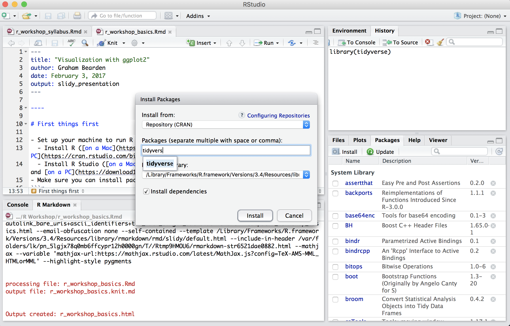

class: inverse, middle, center

# Getting Started

```{r setup, include=FALSE}
library(tidyverse)
library(knitr)
library(countdown)
library(tidycensus)
options(scipen=999)

opts_chunk$set(warning=FALSE, message=FALSE)

airbnb <- read_csv('https://bit.ly/3oadz2L', col_types = cols())
climate <- read_csv('https://bit.ly/3kKErEb', col_types = cols())
mba <- read_csv("https://bit.ly/4evYpeW", col_types = cols())

# Census chunks only run when a key is available (see census_api_key())
has_census_key <- nzchar(Sys.getenv("CENSUS_API_KEY"))
if (has_census_key) {
  wa_counties <- get_acs(
    geography = "county",
    state = "WA",
    variables = c(median_income = "B19013_001", population = "B01003_001"),
    year = 2024,
    output = "wide"
  )
}
```

---

# Set Up

- Set up your machine to run R
  - Install R [on a Mac with an Intel chip](https://cloud.r-project.org/bin/macosx/big-sur-x86_64/base/R-4.6.1-x86_64.pkg), [on a Mac with a silicon chip](https://cloud.r-project.org/bin/macosx/sonoma-arm64/base/R-4.6.1-arm64.pkg), or [on a PC](https://cloud.r-project.org/bin/windows/base/R-4.6.1-win.exe)
  - Install RStudio [on a Mac](https://download1.rstudio.org/electron/macos/RStudio-2026.09.0-174.dmg) or [on a PC](https://download1.rstudio.org/electron/windows/RStudio-2026.09.0-174.exe)
- Save a Census API key so R can pull Census data
  1. Request a free [Census API key](https://api.census.gov/data/key_signup.html) and find it in your email
  2. Paste your key between the quotes below and run the code in the RStudio **Console** (not in a script)
  3. Restart R: **Session > Restart R**

```r
install.packages("tidycensus")
tidycensus::census_api_key("PASTE-YOUR-KEY-HERE", install = TRUE)
Sys.getenv("CENSUS_API_KEY") # After restarting R, this should print your key
```

- OPTIONAL: Create a [Claude](https://claude.com/), [ChatGPT](https://chatgpt.com/), and/or [GitHub Copilot](https://github.com/features/copilot) account

---

# R and the R Programmer 

- Typical uses for R
  - Data preparation (cleaning, reshaping, creation)  
  - Data analysis
  - Data visualization
  - Modeling 
  - Productizing and automation
- Mental models and analysis tools
  - Excel/SPSS/Stata --> computational programming tools like R
- The typical R programmer
  - Leverages Claude, ChatGPT, GitHub Copilot, or another AI assistant
  - Googles for answers
  - Borrows code
  - Asks friends and pros for help
- Useful references (see Reference Materials in the [syllabus](https://gbearden.github.io/r_course_evans_school/) for more)
  - help()
  - ??
  - [R Bloggers](https://www.r-bloggers.com/)
  - [Stack Overflow](https://stackoverflow.com/questions/tagged/r)
  
---

# AI Tools and R Programming

- R programmer AI tools
  - Browser-based tools (Claude, ChatGPT)  
  - Desktop AI assistant apps
  - Desktop AI-enabled code editors (VS Code)  
  - Statistical models (transformers, neural network models, GANs)  
  - Cloud-based Ops orchestration (auto-scaling cloud resources, incident detection)
- Common prompting strategies
  - Role Prompting (*“As if you were a lead data scientist with extensive experience building complex EHR data models [...]”*)
  - Ask for code and explanations
  - Be specific and mention specific tasks, libraries, and error messages
  - Iterate, clarifying if the first answer isn’t right
  - Break down tasks (*“First clean data, then summarize, then plot.”*)
  - Use XML tags (&lt;Tag1&gt;)

---

# Quick Tour of RStudio

- Script vs. notebook  
  - Scripts are good for code development, running code in production, version control, and multi-file analyses
  - Notebooks are good for sharing analysis, documentation, mixed code in a single file
- Run code from the notebook and the console  
  - Console vs. notebooks/scripts
- Make sure you can install packages
  - Command line/Console
  - RStudio GUI

--

```r
install.packages('tidyverse')
```

---

# Quick Tour of RStudio

- Script vs. notebook  
  - Scripts are good for code development, running code in production, version control, and multi-file analyses
  - Notebooks are good for sharing analysis, documentation, mixed code in a single file
- Run code from the notebook and the console  
  - Console vs. notebooks/scripts
- Make sure you can install packages
  - Command line/Console
  - RStudio GUI
  
```{r, echo=FALSE, out.width="60%"}

```

---
class: inverse, middle, center

# Libraries, functions, data

---

#  <span style='color:#6DA34D'>Libraries</span>, functions, data

- Libraries (or packages) are collections of functions (and datasets)
- ~25,178 libraries on [CRAN](https://cran.r-project.org/web/packages/)

```r
install.packages('tidyverse')
library(tidyverse)
```

---

#  Libraries, <span style='color:#6DA34D'>functions</span>, data

- Functions perform operations in R
```r
some_numbers <- c(1,2,4)
# min(), mean(), max(), and sd() are functions. c() is a function too!
min(some_numbers)
mean(some_numbers)
max(some_numbers)
sd(some_numbers)
```

---

#  Libraries, <span style='color:#6DA34D'>functions</span>, data

- Functions perform operations in R
```{r, echo = TRUE, collapse=TRUE}
some_numbers <- c(1,2,4)
# min(), mean(), max(), and sd() are functions. c() is a function too!
min(some_numbers)
mean(some_numbers)
max(some_numbers)
sd(some_numbers)
```

---

#  Libraries, <span style='color:#6DA34D'>functions</span>, data

- Function arguments
  - Arguments are used to specify the data and operation
  - Arguments are comma separated  
  - Let's look at arguments in the `lm` and `min` functions  

```r
help(lm)
help(min)
```

---

#  Libraries, <span style='color:#6DA34D'>functions</span>, data

- Function arguments
  - Arguments are used to specify the data and operation
  - Arguments are comma separated  
  - Let's look at arguments in the `lm` and `min` functions  

```r
some_numbers <- c(1, 2, NA, 4)
min(some_numbers)
mean(some_numbers)
max(some_numbers)
sd(some_numbers)
```

---

#  Libraries, <span style='color:#6DA34D'>functions</span>, data

- Function arguments
  - Arguments are used to specify the data and operation
  - Arguments are comma separated  
  - Let's look at arguments in the `lm` and `min` functions  

```{r, echo = TRUE, collapse=TRUE}
some_numbers <- c(1,2,NA, 4)
min(some_numbers)
mean(some_numbers)
max(some_numbers)
sd(some_numbers)
```

---

#  Libraries, <span style='color:#6DA34D'>functions</span>, data

- Function arguments
  - Arguments are used to specify the data and operation
  - Arguments are comma separated  
  - Let's look at arguments in the `lm` and `min` functions  

```{r, echo = TRUE, collapse=TRUE}
some_numbers <- c(1,2,NA, 4)
min(some_numbers, na.rm = TRUE)
mean(some_numbers, na.rm = TRUE)
max(some_numbers, na.rm = TRUE)
sd(some_numbers, na.rm = TRUE)
```

---

#  Libraries, <span style='color:#6DA34D'>functions</span>, data

**Anatomy of a function**  

```r
compute_mean <- function(x) { 
  # Calculate the sum of all values in `x`
  x_sum <- sum(x, na.rm = TRUE)
  
  # We'll learn more about the ! operator later
  # Just know that the code below used to create `x_clean` removes NA values
  x_clean <- x[!is.na(x)]
  
  # Count the number of values in `x`
  x_len <- length(x_clean)
  
  # Divide `x_sum` by `x_len`
  x_mean <- x_sum / x_len
  
  # `return` is used to tell R the output of the function
  return(x_mean)
  }
```

---

#  Libraries, functions, <span style='color:#6DA34D'>data</span>

- Knowing data types when programming is really important!
  - Creates a set of rules for what operations can be executed  
- Data types  
  - Vectors, data frames, tibbles
      - `str_subset()` removes a value from a string
      - `filter()` removes an observation from a data frame or tibble
  - Vectors
      - Integers, numbers, characters, factors
      - You can sum integers and numbers, but not character strings
      - You can make character strings upper case, but not integers and numbers
  
```r
starwars
```

```{r, echo = FALSE, collapse=FALSE}
head(starwars, 3)
```

---

#  Libraries, functions, <span style='color:#6DA34D'>data</span>

**More on data types**

- Inspect the dataset  
  - `class()` tells the overall type  
  - `is.[type]()` checks if something is numeric, character, etc.  
- Access parts of a dataset  
  - `$` to pull a column as a vector  
  - `[ ]` to pull elements by position  
- Create and coerce variables  
  - `as.character()`, `as.numeric()`  

**Import and inspect your own dataset with `read_csv()`**  

```r
byod_df <- read_csv("[...].csv")
# Or take a look at the 538 partisan lean dataset from 2022
# https://github.com/fivethirtyeight/data/tree/master/partisan-lean
byod_df <- read_csv("http://bit.ly/48Ru0Ip")
```

---

#  Libraries, functions, <span style='color:#6DA34D'>data</span>

**Pull data from the U.S. Census Bureau with `tidycensus`**

```r
library(tidycensus)

wa_counties <- get_acs(
  geography = "county",
  state = "WA",
  variables = c(median_income = "B19013_001", population = "B01003_001"),
  year = 2024,
  output = "wide"
)
```

**Troubleshooting**
- Error that a key already exists? Re-run the set up code with `overwrite = TRUE` added, then restart R
- `Sys.getenv("CENSUS_API_KEY")` prints `""`? Restart R (**Session > Restart R**) and check again

---
class: inverse, middle, center

# Let's apply what we learned to real data

---

# Let's apply what we learned to real data

You are an analyst at the City of Seattle. City leadership wants to develop new policy to regulate Airbnb properties. Over the next month, you will be asked to prepare findings that you observe in the [dataset compiled on Airbnb properties](https://www.kaggle.com/datasets/shanelev/seattle-airbnb-listings).  

--

**Exercise - 5 minutes**  
- What type of data object is `airbnb`?  
- What is the smallest number of `reviews` for a property?  
- What is the average number of `reviews` for a property?  
- What is the range of the number of `bathrooms` in the `airbnb` data?  

--

To answer the questions, import the Seattle `airbnb` dataset.  
```r
airbnb <- read_csv('https://bit.ly/3oadz2L')
```

```{r, echo = FALSE}
countdown(minutes = 5, seconds = 0)
```

---

# Let's apply what we learned to real data

**Exercise - 5 minutes**  
- What type of data object is `airbnb`?  
- What is the smallest number of `reviews` for a property?  
- What is the average number of `reviews` for a property?  
- What is the range of the number of `bathrooms` in the `airbnb` data?  

```{r, echo = TRUE, collapse=TRUE}
class(airbnb)
```

--

```{r, echo = TRUE, collapse=TRUE}
min(airbnb$reviews)
mean(airbnb$reviews)
```

--

```{r, echo = TRUE, collapse=TRUE}
min(airbnb$bathrooms, na.rm = TRUE)
max(airbnb$bathrooms, na.rm = TRUE)
```

---
class: inverse, middle, center

# Base R functions to explore tibbles

---

# Base R functions to explore tibbles 

Get in the habit of running these functions when you open a new dataset

- `head()` shows you the top of a tibble (or data frame)
  - `head()` shows 6 rows by default  
  - `tail()` shows the bottom of a tibble  
  - `arrange()` pairs nicely with subsetting functions to explore your data
- `summary()` shows summary statistics on all variables in a dataset
  - Reported summary statistics depend on the variable type
  - Min, max, mean, and median are reported for numeric variables 
- `ls()` shows all variables in a tibble
  - You can also use `ls()` without calling an object between the parentheses to see all objects in your workspace
- `str()` tells the variable type and selected variable values in a tibble for all variables
- `dim()` tells you the dimensions of your dataset
  - `nrow()` reports the number of rows only 
  - `ncol()` reports the number of columns only

---

# Base R functions to explore tibbles

**Exercise 2 - 5 minutes**  
- How many observations (or rows) are in `airbnb`?  
- What is the median value for `rating`?  
- How many variables are in `airbnb`?  

<i>Hint: There are multiple ways to answer these questions with the functions you know</i>

```{r, echo = FALSE}
countdown(minutes = 5, seconds = 0)
```

---

# Base R functions to explore tibbles

**Exercise 2 - 5 minutes**  
- How many observations (or rows) are in `airbnb`?  
- What is the median value for `rating`?  
- How many variables are in `airbnb`?  

```{r, echo = TRUE, collapse=TRUE}
nrow(airbnb)
```

--

```{r, echo = TRUE, collapse=TRUE}
median(airbnb$rating, na.rm = TRUE)
```

--

```{r, echo = TRUE, collapse=TRUE}
ncol(airbnb)
```

--

Other methods to answer questions
```r
dim(airbnb)
summary(airbnb)
```

---

# Base R functions to explore vectors

- `table()` shows you the distribution of values in a vector  
  - Indexed by name and position  
- `length()` tells you the number of elements in a vector  
- `unique()` shows you the unique values in a vector  
- `sort()` orders values in a vector  
- `summary()` shows you descriptive statistics on a vector  
  - `summary()` can run on a vector or tibble  

--

You can nest multiple functions
```r
length(unique(wa_counties$NAME))
```

---

# Base R functions to explore vectors

**Exercise 3 - 5 minutes**  
- How many distinct `address` values are there?  
- Which is the third `host_id` value after sorting unique ids alphabetically?  
- Is 'yurt' a `room_type` value?  

```{r, echo = FALSE}
countdown(minutes = 5, seconds = 0)
```

---

# Base R functions to explore vectors

**Exercise 3 - 5 minutes**  
- How many distinct `address` values are there?  
- Which is the third `host_id` value after sorting unique ids alphabetically?  
- Is 'yurt' a `room_type` value?  

```{r, echo = TRUE, collapse=TRUE}
length(unique(airbnb$address))
```

--

```{r, echo = TRUE, collapse=TRUE}
sort(unique(airbnb$host_id))[3]
```

--

```{r, echo = TRUE, collapse=TRUE}
unique(airbnb$room_type)
```

---

# Troubleshooting your R code

Make sure...

- You loaded your libraries
- Arguments in your functions are comma-separated
- Your functions have opening and closing parentheses
- You have start and end quotation marks where relevant
- The variable type is correct to perform the function you call
  - For example, you probably don't want to run `min()` on a character string
- Your assignment operator looks like this: `<-`
- You're running code inside a code chunk (in a notebook)

--

Feel free to ask an AI assistant why you see an error!

```
Why does this code throw an error in R? 
[Your code]
```

---

# Practice with climate data

By day you're an analyst at the City of Seattle; by night you're a climate analyst at the Earth Institute. Over the next four weeks, you will analyze [climate data](https://www.kaggle.com/datasets/berkeleyearth/climate-change-earth-surface-temperature-data) to answer questions that help the Earth Institute understand temperature and temperature change in cities and countries around the world.

--

**Exercise 4 - 10 minutes**  
- What is the earliest `year` in the `climate` dataset?  
- What is the range of `uncertainty` values?  
- How many cities and countries are in the dataset?  
- In how many rows in the dataset is Japan the `country` value?  

--

<b>Begin the exercise by importing the climate dataset in RStudio</b>  
```r
climate <- read_csv('https://bit.ly/3kKErEb')
```

```{r, echo = FALSE}
countdown(minutes = 10, seconds = 0)
```

---

# Practice with climate data

**Exercise 4 - 10 minutes**  
- What is the earliest `year` in the `climate` dataset?  
- What is the range of `uncertainty` values?  
- How many cities and countries are in the dataset?  
- In how many rows in the dataset is Japan the `country` value?  

```{r, echo = TRUE, collapse=TRUE}
min(climate$year)
```

--

```{r, echo = TRUE, collapse=TRUE}
min(climate$uncertainty, na.rm = TRUE)
max(climate$uncertainty, na.rm = TRUE)
```

--

```{r, echo = TRUE, collapse=TRUE}
length(unique(climate$city))
length(unique(climate$country))
```

---

# Practice with climate data

**Exercise 4 - 10 minutes**  
- What is the earliest `year` in the `climate` dataset?  
- What is the range of `uncertainty` values?  
- How many cities and countries are in the dataset?  
- In how many rows in the dataset is Japan the `country` value?  

```{r, echo = TRUE, collapse=TRUE}
table(climate$country)['Japan']
```

---

# More practice - MBA admissions

You can find a description of the synthetic MBA admissions data [here](https://www.kaggle.com/datasets/taweilo/mba-admission-dataset). The data were generated from the University of Pennsylvania Wharton Class of 2025.

--

**Exercise 5 - 8 minutes**  
- What is the lowest `gpa` in the `mba` dataset?  
- What is the average number of years of work experience (`work_exp`)?  
- How many applicants are international students?  
- In how many rows in the dataset is "Consulting" the `work_industry` value?  

--

<b>Begin the exercise by importing the MBA admissions dataset in RStudio</b>  
```r
mba <- read_csv("https://bit.ly/4evYpeW")
```

```{r, echo = FALSE}
countdown(minutes = 8, seconds = 0)
```

---

# More practice - MBA admissions

**Exercise 5 - 8 minutes**  
- What is the lowest `gpa` in the `mba` dataset?  
- What is the average number of years of work experience (`work_exp`)?  
- How many applicants are international students?  
- In how many rows in the dataset is "Consulting" the `work_industry` value?  

```{r, echo = TRUE, collapse=TRUE}
min(mba$gpa)
```

--

```{r, echo = TRUE, collapse=TRUE}
mean(mba$work_exp, na.rm = TRUE)
```

--

```{r, echo = TRUE, collapse=TRUE}
table(mba$international)
```

---

# More practice - MBA admissions

**Exercise 5 - 8 minutes**  
- What is the lowest `gpa` in the `mba` dataset?  
- What is the average number of years of work experience (`work_exp`)?  
- How many applicants are international students?  
- In how many rows in the dataset is "Consulting" the `work_industry` value?  

```{r, echo = TRUE, collapse=TRUE}
table(mba$work_industry)['Consulting']
```
