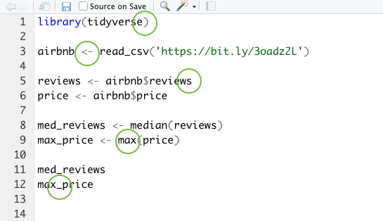

```{r setup, include=FALSE}
library(tidyverse)
library(knitr)
library(countdown)
library(kableExtra)
library(lubridate)
options(scipen=999)

opts_chunk$set(warning=FALSE, message=FALSE)

airbnb <- read_csv('https://bit.ly/3oadz2L', col_types = cols())
climate <- read_csv('https://bit.ly/3kKErEb', col_types = cols())

colombia <- climate %>% 
  filter(! is.na(temp) & year > 2000 & country == 'Colombia') %>% 
  transmute(
    year
    , month
    , city
    , fahrenheit = (temp * 9/5) + 32
    )
```

# Housekeeping

- [...]

---

# What we learned in the previous class

- Getting up and running in RStudio  
- Core R concepts  
  - Data types
  - Relationship between data and functions  
- How to import data  
- Regularly used data summary functions  
- Assignment operator (`<-`)
- A bit about troubleshooting

---

# What we'll learn today  

- More about troubleshooting
- Creating and updating variables  
- Subsetting tibbles/data frames  
- Aggregation  

---

# Troubleshooting your R code

Make sure...

- You loaded your libraries
- Arguments in your functions are comma-separated
- Your functions have start and closing parentheses
- You have start and end quotation marks where relevant
- The variable type is correct to perform the function you call
  - For example you probably don't want to run `min()` on a character string  
- Variables in your environment are spelled correctly  (`ls()`)  
- Your assignment operator looks like this: `<-`
- You're running code inside a code chunk (in a notebook)
- The casing is right (for example, `read_csv()`, not `READ_CSV()`)  

---

# Troubleshooting your R code

- Run code line by line  

--
- Ensure the code isn't hanging (`+`s vs. `>`s in the R console)  

--
- Red "x" annotation beside line numbers (after saving your file)


---

# Troubleshooting exercise 

**Exercise 1 - 5 minutes**  

This code contains 5 mistakes. The code should create four new data objects called `reviews`, `price`, `med_reviews` and `max_price` and report the median number of reviews and highest cost/night for a Seattle Airbnb rental.    

- Correct 5 coding mistakes  
- Reference the previous slides for help  

--

```r
library(tidyverse
        
airbnb < read_csv('https://bit.ly/3oadz2L')

reviews <- airbnb$review
price <- airbnb$price

med_reviews <- median(reviews)
max_price <- MAX(price)

med_reviews
max.price
```

```{r, echo = FALSE}
countdown(minutes = 5, seconds = 0)
```

---

# Troubleshooting exercise 

**Exercise 1 - 5 minutes**  

This code contains 5 mistakes. The code should create four new data objects called `reviews`, `price`, `med_reviews` and `max_price` and report the median number of reviews and highest cost/night for a Seattle Airbnb rental.  


--

<br>
Is [ChatGPT](https://chat.openai.com/) able to help troubleshoot?

---
class: inverse, middle, center

# Select, create, and rename variables

---

# <span style="color:#6DA34D">Select</span>, create, and rename variables 

- `select()` keeps the named variables from the dataset
- You can remove variables from the dataset with `-`
- You may use selection helpers
  - For example, `everything()`
- Use `'``'` for multi-word variables and variable names that begin with numbers

--

```r
select(airbnb, host_id, reviews, rating, price)
```

```{r, echo = FALSE, collapse=TRUE}
head(select(airbnb, host_id, reviews, rating, price), 3) %>% 
  kbl() %>% 
  kable_classic() %>% 
  kable_styling(full_width = F, position = 'float_left')
```

---

# <span style="color:#6DA34D">Select</span>, create, and rename variables 

- `select()` keeps the named variables from the dataset
- You can remove variables from the dataset with `-`
- You may use selection helpers
  - For example, `everything()`
- Use `'``'` for multi-word variables and variable names that begin with numbers

```r
airbnb_2 <- select(airbnb, host_id, reviews, rating, price)
select(airbnb_2, -rating)
```

```{r, echo = FALSE, collapse=TRUE}
head(select(select(airbnb, host_id, reviews, rating, price), -rating), 3) %>% 
  kbl() %>% 
  kable_classic() %>% 
  kable_styling(full_width = F, position = 'float_left')
```

---

# <span style="color:#6DA34D">Select</span>, create, and rename variables

- `select()` keeps the named variables from the dataset
- You can remove variables from the dataset with `-`
- You may use selection helpers
  - For example, `everything()`
- Use `'``'` for multi-word variables and variable names that begin with numbers

```r
airbnb_2 <- select(airbnb, host_id, reviews, rating, price)
select(airbnb_2, host_id, price, everything())
```

```{r, echo = FALSE, collapse=TRUE}
head(select(select(airbnb, host_id, reviews, rating, price), host_id, price, everything()), 3) %>% 
  kbl() %>% 
  kable_classic() %>% 
  kable_styling(full_width = F, position = 'float_left')
```

---

# Make your code as readable as possible

- A whole course could be taught on formatting code
- For our course, use the pipe operator (`%>%`) when working with **tibbles/data frames**  

--

**Bad** 
```r
select(select(airbnb, host_id, reviews, rating, price), host_id, price, everything())
```

**Good** 
```r
airbnb %>%
  select(host_id, reviews, rating, price) %>% 
  select(host_id, price, everything())
```

**Use pipes if possible, but this is okay** 
```r
airbnb_2 <- select(airbnb, host_id, reviews, rating, price)
select(airbnb_2, host_id, price, everything())
```

---

# Make your code as readable as possible

- Use the pipe operator (`%>%`) when working with **tibbles/data frames**  
  - Easier to read and troubleshoot  
  - Easier to comment (write end of line comments or above line comments)
  - Modular
  - Makes data management within your script easier  
  - Style-wise, pipes are the present and future

```r
airbnb %>%
  select(host_id, reviews, rating, price) %>% 
  select(host_id, price, everything()) 
```

---

# Select, <span style="color:#6DA34D">create</span>, and rename variables

- `mutate()` creates variables  
- Create multiple variables at once
- Use functions you already learned within `mutate()`
  - `min()`, `max()`, `mean()`
  - `as.character()`, `as.factor()`, `as.numeric()`
- Use `if_else()` within `mutate()`

--

```r
airbnb %>% 
  mutate(
    cost_per_num_accom = price / accommodates,
    mean_price = mean(price)
    ) 
```

---

# Select, <span style="color:#6DA34D">create</span>, and rename variables 

- `mutate()` creates variables
- Create multiple variables at once
- Use functions you already learned within `mutate()`
  - `min()`, `max()`, `mean()`
  - `as.character()`, `as.factor()`, `as.numeric()`
- Use `if_else()` within `mutate()`

```r
x <- c(1, 2, 3)
y <- c(4, 5, 1)

if_else(x > y, 'yes', 'no')
```

---

# Select, <span style="color:#6DA34D">create</span>, and rename variables

- `mutate()` creates variables
- Create multiple variables at once
- Use functions you already learned within `mutate()`
  - `min()`, `max()`, `mean()`
  - `as.character()`, `as.factor()`, `as.numeric()`
- Use `if_else()` within `mutate()`

```{r, echo = TRUE, collapse=TRUE}
x <- c(1, 2, 3)
y <- c(4, 5, 1)

if_else(x > y, 'yes', 'no')
```

---

# Select, <span style="color:#6DA34D">create</span>, and rename variables

- A little more on `if_else()`  
  - A logical test with a true-or-false outcome
  - To make comparisons use: `==`, `<`, `<=`, `>`, `>=`, `!=`, `%in%`, `!`, `is.na()`
     - `==` 1 to 1 equivalency test
     - `%in%` lets you search for equivalency over a string
  - Concatenate values with `c()`

--

```{r, echo = TRUE, collapse=TRUE}
city_1 <- 'San Francisco'
city_2 <- 'Portland'
california <- c('San Francisco', 'Los Angeles', 'San Diego')

if_else(city_1 %in% california, 'yes', 'no')
if_else(city_2 %in% california, 'yes', 'no')
if_else(237 %in% 200:300, 'yes', 'no')
```

---

# Select, <span style="color:#6DA34D">create</span>, and rename variables

- A little more on `if_else()`  
  - A logical test with a true-or-false outcome
  - To make comparisons use: `==`, `<`, `<=`, `>`, `>=`, `!=`, `%in%`, `!`, `is.na()`
     - `==` 1 to 1 equivalency test
     - `%in%` lets you search for equivalency over a string
  - Concatenate values with `c()`

```{r, echo = TRUE, collapse=TRUE}
city_1 <- 'San Francisco'
city_2 <- 'Portland'
california <- c('San Francisco', 'Los Angeles', 'San Diego')

if_else(! city_1 %in% california, 'yes', 'no')
if_else(! city_2 %in% california, 'yes', 'no')
if_else(! 237 %in% 200:300, 'yes', 'no')
```

---

# Select, <span style="color:#6DA34D">create</span>, and rename variables

- `mutate()` creates variables
- Create multiple variables at once
- Use functions you already learned within `mutate()`
  - `min()`, `max()`, `mean()`
  - `as.character()`, `as.factor()`, `as.numeric()`
- Use `if_else()` within `mutate()`

```r
airbnb %>% 
  mutate(
    cost_per_num_accom = price / accommodates,
    mean_price = mean(price),
    seattle_address = if_else(address == 'Seattle', 'y', NA),
    large = if_else(accommodates > 5, 'y', NA)
    ) 
```

---

# Select, <span style="color:#6DA34D">create</span>, and rename variables 

```r
airbnb %>% 
  mutate(
    cost_per_num_accom = price / accommodates,
    mean_price = mean(price),
    seattle_address = if_else(address == 'Seattle', 'y', NA),
    large = if_else(accommodates > 5, 'y', NA)
    ) %>%
  select(room_id, host_id, cost_per_num_accom, mean_price, seattle_address, large)
```

```{r, echo = FALSE, collapse=TRUE}
airbnb %>% 
  mutate(
    cost_per_num_accom = price / accommodates,
    mean_price = mean(price),
    seattle_address = if_else(address == 'Seattle', 'y', NA),
    large = if_else(accommodates > 5, 'y', NA)
    ) %>%
  select(room_id, host_id, cost_per_num_accom, mean_price, seattle_address, large) %>%
  head(5) 
```

---

# Select, <span style="color:#6DA34D">create</span>, and rename variables 

<b>Exercise - 6 minutes</b>  
- With the `climate` dataset, create variables called `high_uncertainty` and `winter`
- In `high_uncertainty`, flag with a `1` all observations where `uncertainty` is greater than 1.5. All other rows should have a `0`.  
- In `winter`, flag with a `1` all observations where month is a 1, 2, 12.  
- Only report the following variables in the output: `country`, `city`, `high_uncertainty` and `winter`

--

```r
climate <- read_csv('https://bit.ly/3kKErEb')
```

```{r, echo = FALSE}
countdown(minutes = 6, seconds = 0)
```

---

# Select, <span style="color:#6DA34D">create</span>, and rename variables 

<b>Exercise - 6 minutes</b>  
- With the `climate` dataset, create variables called `high_uncertainty` and `winter`
- In `high_uncertainty`, flag with a `1` all observations where `uncertainty` is greater than 1.5. All other rows should have a `0`  
- In `winter`, flag with a `1` all observations where month is a 1, 2, 12.  
- Only report the following variables in the output: `country`, `city`, `high_uncertainty` and `winter`

```r
climate %>% 
  mutate(
    high_uncertainty = if_else(uncertainty > 1.5, 1, 0),
    winter = if_else(month %in% c(1, 2, 12), 1, 0)
    ) %>%
  select(country, city, high_uncertainty, winter)
```

---

# Select, <span style="color:#6DA34D">create</span>, and rename variables 

```r
climate %>% 
  mutate(
    high_uncertainty = if_else(uncertainty > 1.5, 1, 0),
    winter = if_else(month %in% c(1, 2, 12), 1, 0)
    ) %>%
  select(country, city, high_uncertainty, winter)
```

```{r, echo = FALSE, collapse=TRUE}
climate %>% 
  mutate(
    high_uncertainty = if_else(uncertainty > 1.5, 1, 0),
    winter = if_else(month %in% c(1, 2, 12), 1, 0)
    ) %>%
  select(country, city, high_uncertainty, winter) %>%
  head()
```

<div class="animate__animated animate__bounce" style="color: #363457; background-color: white">
  <p id="clickToShow" style="display: none;">Nice job! Now take a moment to ask ChatGPT to annotate your code.</p>
  <button id="revealButton">Do Not Push</button>
</div>

<script>
// JavaScript to reveal the hidden text on button click
document.getElementById('revealButton').addEventListener('click', function() {
  document.getElementById('clickToShow').style.display = 'block';
});
</script>

---

# Select, <span style="color:#6DA34D">create</span>, and rename variables 

- `transmute()` = `mutate()` + `select()`

--

```r
climate %>% 
  mutate(
    high_uncertainty = if_else(uncertainty > 1.5, 1, 0),
    winter = if_else(month %in% c(1, 2, 12), 1, 0)
    ) %>%
  select(country, city, high_uncertainty, winter)
```

--

```r
climate %>% 
  transmute(
    country,
    city,
    high_uncertainty = if_else(uncertainty > 1.5, 1, 0),
    winter = if_else(month %in% c(1, 2, 12), 1, 0)
    )
```

---

# Select, create, and <span style="color:#6DA34D">rename</span> variables 

- `rename()` assigns a new name to an existing variable
- Renaming is possible with `transmute()` and `mutate()`as well
  - `rename()`: renames selected variables, keeps all other variables
  - `transmute()`: renames selected variables, drops all other variables
  - `mutate()`: creates new variables (with new names) and keeps originals
- Each variable transformation is comma-separated  

**Example**
- How do I rename `address` as `city`, `price` as `cost`, and `name` as `description` with one of the methods in `airbnb`?

--

```r
airbnb %>% 
  rename(
    city = address,
    cost = price,
    description = name
    ) 
```

---

# Select, create, and <span style="color:#6DA34D">rename</span> variables 

- `rename()` assigns a new name to an existing variable
- Renaming is possible with `transmute()` and `mutate()`as well
  - `rename()`: renames selected variables, keeps all other variables
  - `transmute()`: renames selected variables, drops all other variables
  - `mutate()`: creates new variables (with new names) and keeps originals
- Each variable transformation is comma-separated  

```r
airbnb %>% 
  mutate(
    city = address,
    cost = price,
    description = name
    ) 
```

--

```r
airbnb %>% 
  transmute(
    city = address
    cost = price
    description = name
    ) 
```

---

# Exercise - 6 minutes

- With `climate`, create a tibble that meets the following conditions:  
  - It contains three variables: `year`, `location`, `temp`
  - Make no changes to `year` 
  - Rename `city` as `location`
  - In `temp`, change `NA` values to `0`  

```{r, echo = FALSE}
countdown(minutes = 6, seconds = 0)
```

---

# Exercise - 6 minutes

- With `climate`, create a tibble that meets the following conditions:  
  - It contains three variables: `year`, `location`, `temp`
  - Make no changes to `year` 
  - Rename `city` as `location`
  - In `temp`, change `NA` values to `0`  

```r
climate %>% 
  transmute(
    year
    location = city
    temp = if_else(is.na(temp), 0, temp)
    ) 
```

---
class: inverse, middle, center

# Filter tibbles

---

# Filter tibbles

- Use `filter()` to subset your data
- With `filter()`, you tell R to exclude/include rows that meet a logical TRUE/FALSE condition
- Operators for conditions are the same as for `if_else()`: `==`, `<`, `<=`, `>`, `>=`, `!=`, `%in%`, `!`, `is.na()`

```r
airbnb %>% 
  filter(address != 'Seattle') %>% 
  select(room_id, host_id, address)
```

---

# Filter tibbles 
- You can stipulate multiple conditions with `filter()`
  - Use `&` for 'and' expressions
  - Use `|` for 'or' expressions
  - If there are two or more sets of conditions, wrap conditions in `()` or use more than one `filter()`

```r
airbnb %>% 
  filter(price > 50 & price < 100 & room_type == 'Entire home/apt') %>% 
  select(room_id, host_id, address, room_type, rating, name)
```

---

# Filter tibbles
- Other functions for subsetting your data
  - `head()`
  - `tail()`
  - `sample_n()`
  
--

```{r, echo = TRUE, collapse=TRUE}
airbnb %>% sample_n(3) %>% select(room_id, host_id, address, room_type, price, name)
```

--

```{r, echo = TRUE, collapse=TRUE}
airbnb %>% sample_n(3) %>% select(room_id, host_id, address, room_type, price, name)
```

---

# Exercise - 12 minutes

.pull-left[
- Create a dataset called `colombia` that meets these conditions:  
  - Contains `temp` values not equal to `NA`  
  - Contains data for 'Colombia' only
  - Contains no dates prior to January 2001
  - Contains a variable called `fahrenheit` that converts the `temp` value from celsius to fahrenheit. Use the formula: `(temp * 9/5) + 32` 
  - Contains 4 variables in total in the following order: `year`, `month`, `city`, `fahrenheit`  
  - With extra time, annotate your code (feel free to use ChatGPT)  
]

.pull-right[
- Determine the following: 
  - The number of rows that meet the above filtering conditions  
  - The fahrenheit mean in `colombia`
  - The names of cities in `colombia`
]

```{r, echo = FALSE}
countdown(minutes = 12, seconds = 0)
```

---

# Exercise - 12 minutes

- Create a dataset called `colombia` that meets these conditions  
  - Contains `temp` values not equal to `NA`  
  - Contains data for 'Colombia' only
  - Contains no dates prior to January 2001
  - Contains a variable called `fahrenheit` that converts the `temp` value from celsius to fahrenheit. Use the formula: `(temp * 9/5) + 32` 
  - Contains 4 variables in total in the following order: `year`, `month`, `city`, `fahrenheit`  
  - With extra time, annotate your code (feel free to use ChatGPT)  

```r
colombia <- climate %>% 
  filter(! is.na(temp) & year > 2000 & country == 'Colombia') %>% 
  transmute(
    year,
    month,
    city,
    fahrenheit = (temp * 9/5) + 32
    )
```

---

# Exercise - 12 minutes

- Determine the following: 
  - The number of rows that meet the above filtering conditions  
  - The fahrenheit mean in `colombia`
  - The names of cities in `colombia`

```{r, echo = TRUE, collapse=TRUE}
nrow(colombia)
colombia %>% pull(fahrenheit) %>% mean # OR mean(colombia$fahrenheit)
colombia %>% pull(city) %>% unique # OR unique(colombia$city)
```

---
class: inverse, middle, center

# Dates

---

# Dates

Working with dates can be difficult  
- Date formats vary across datasets
  - POSIXct, POSIXlt, Date, Period, chron, yearmon, yearqtr, zoo, zooreg, timeDate, xts, its, ti, jul, and fts
- Some formats contain metadata
  - timezone, leap year, GMT adjustment
- Some formats are quirky  
  - For example, the month number for January in POSIXlt is 0
- Sometimes dates include times, sometimes not
  - Time can make it challenging to extract date components
- Dates formatted as character strings look right, but often leads to data visualization mistakes and problems in analysis
  - `sort(c('2021-10-02', '2021-1-22', '2021-3-20'))`  
  - `sort(lubridate::ymd(c('2021-10-02', '2021-1-22', '2021-3-20')))`
  
---

# Dates

There are ways to make working with dates easier
  - Use `lubridate` package
    - Dates always formatted as "Date" type
  - Put components of dates in distinct columns if possible  
  - Remove time from date if possible

```r
install.packages('lubridate')
```

--

- Create dates with `lubridate` functions (`ymd()`, `dmy()`, `mdy()`, `ym()`)
  - Apply functions to character values, `'2020-03-15'`  
  - Apply functions to concatenated tibble columns using `paste0()`

--

```r
ymd('2020-03-15')
dmy('15-03-2020')
class(ymd('2020-03-15'))
```

```r
climate %>% 
  mutate(
    date = ym(paste0(year, '-', month))
  )
```

---

# Dates

- Extract components from a date
  - `year()`, `month()`, `day()`
  - May be applied to multiple date formats/classes

---

# Dates

**Exercise - 10 minutes**  

From `climate`, produce a tibble called `turkey` that meets the following requirements:

- Contains data for the country of Turkey only
- Contains data for years 2000 through 2010
- Contains three columns: `city`, `date`, and `temp`
- `date` should be a date variable created from `year` and `month`
- Arrange the dataset by `date` in descending order (`arrange(desc(date))`)

Report the mean monthly temperatures for one city in the dataset (you choose)

```{r, echo = FALSE}
countdown(minutes = 10, seconds = 0)
```

---

```r
turkey <- climate %>% 
  filter(country == 'Turkey' & year %in% 2000:2010) %>% 
  transmute(
    city,
    date = ym(paste0(year, '-', month)),
    temp
  ) %>% 
  arrange(desc(date))
```

--

```r
turkey %>% 
  filter(city == 'Ankara') %>% 
  mutate(m = month(date)) %>% 
  group_by(m) %>% 
  summarise(mean_temp = mean(temp))
```