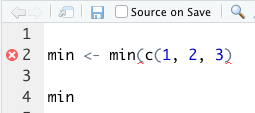
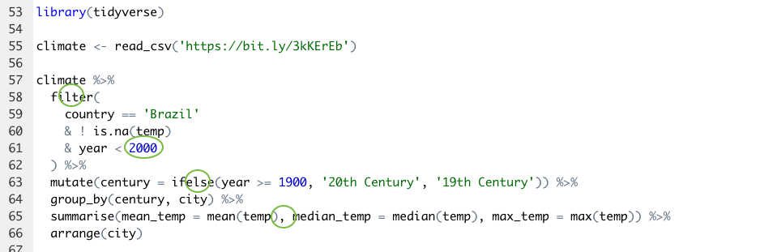
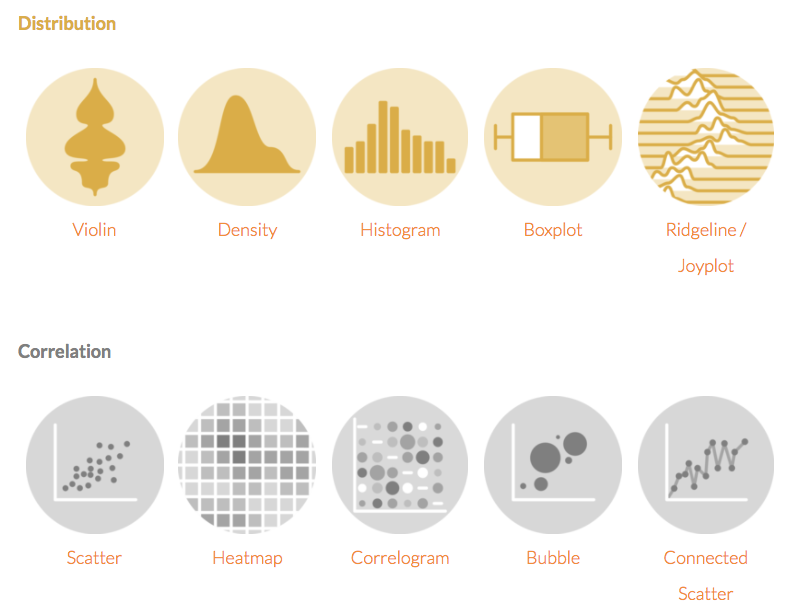
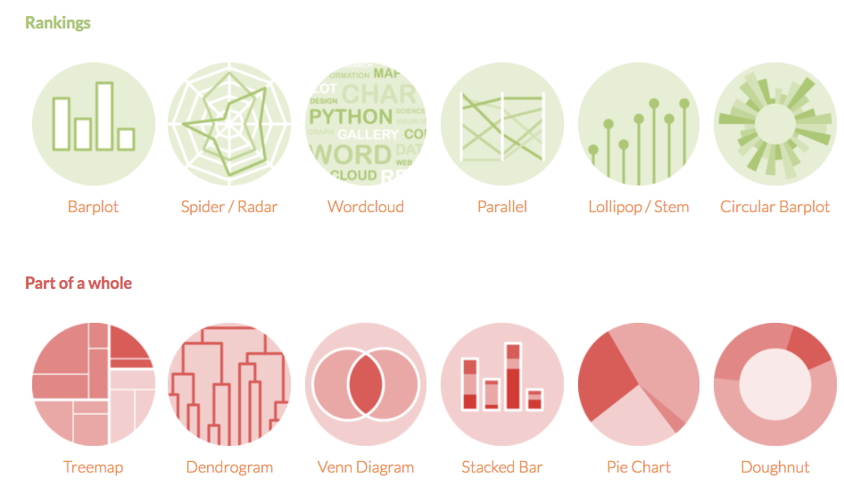
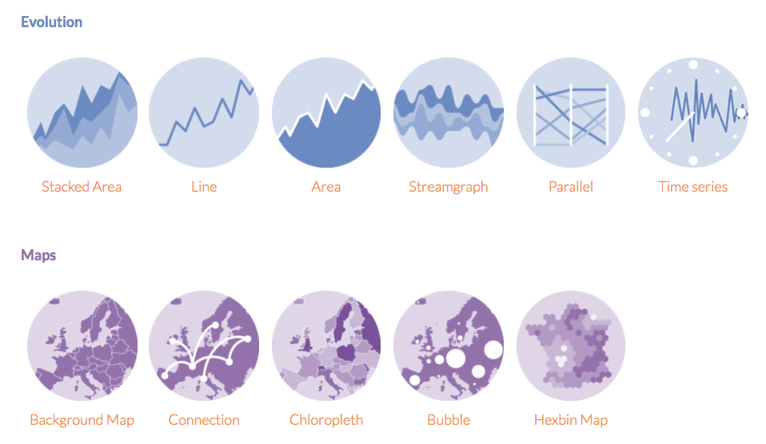
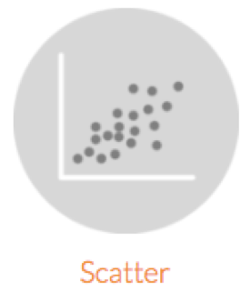
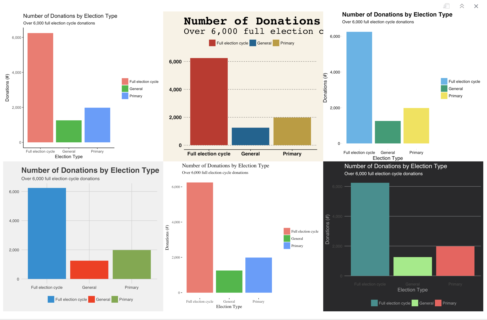

# Preamble

SAVE FOR ANSWERING QUESTIONS HELD OVER FROM THE PREVIOUS CLASS

```{r setup, include=FALSE}
library(tidyverse)
library(knitr)
library(countdown)
library(kableExtra)
library(formatR)
options(scipen=999)

opts_chunk$set(warning=FALSE, message=FALSE)

airbnb <- read_csv('https://bit.ly/3oadz2L', col_types = cols())
climate <- read_csv('https://bit.ly/3kKErEb', col_types = cols())
```

---

# What we learned in the previous class

- A bit more about troubleshooting
- Chaining together functions with a pipe operator (`%>%`)
- Selecting, creating, and updating variables  
- Subsetting tibbles/data frames  
- Aggregation  
- Dates

---

# What we'll learn today  

- Overview of ggplot2  
- Building bar, line, and scatter plots  
  - Aggregated data
  - Disaggregated data
- Customizing plots

---

# A reminder on troubleshooting

- Run code line by line  
- Ensure the code finished running (`+`s vs. `>`s in the R console)  
- Red "x" annotation beside line numbers (after saving your file)



---

# Troubleshooting exercise 

**Exercise 1 - 5 minutes**  

This code contains 4 mistakes. The code is supposed to report the mean, median, and max temperatures for Brazilian cities in the 19th and 20th centuries.      

--

```r
library(tidyverse)
        
climate <- read_csv('https://bit.ly/3kKErEb')

climate %>% 
  fitler(
    country == 'Brazil' 
    & ! is.na(temp) 
    & year < 200
  ) %>% 
  mutate(century = ifese(year >= 1900, '20th Century', '19th Century')) %>% 
  group_by(century, city) %>% 
  summarise(
    mean_temp = mean(temp) 
    median_temp = median(temp)
    , max_temp = max(temp)
    ) %>% 
  arrange(city)
```

```{r, echo = FALSE}
countdown(minutes = 5, seconds = 0)
```

---

# Troubleshooting exercise 

**Exercise 1 - 5 minutes**  

This code contains 4 mistakes. The code is supposed to report the mean, median, and max temperatures for Brazilian cities in the 19th and 20th centuries.      



---
class: inverse, middle, center

# Visualization with ggplot2

---

Import `airbnb` data if you have not already

```r
airbnb <- read_csv('https://bit.ly/3oadz2L', col_types = cols())
```

---

# ggplot2

- Yardstick for plotting data in R  
- Part of the `tidyverse` collection of packages  
- Virtually no limits to plot types (when leveraging supplemental libraries)  
- Plotting resources  
  - [ggplot2 Launch Page](http://ggplot2.tidyverse.org/)
  - [Top 50 ggplot2 Visualizations](http://r-statistics.co/Top50-Ggplot2-Visualizations-MasterList-R-Code.html)

---

# Plot types



---

# Plot types



---

# Plot types



---

# Plot types

What we will learn

    

--

Requests to learn another plot type?

---

# Plot types

.pull-left[
1 discrete variable (plus other optional discrete and/or continuous variables)  

   

1 continuous variable  

  
]

.pull-right[
2 continuous variables  

  

1 continuous variable + date variable  

  
]

---

# Confirm that you can plot data 

```r
library(tidyverse)
mpg %>% ggplot() + geom_point(aes(displ, hwy))
```

--

```{r, echo = FALSE, collapse=TRUE, fig.height = 4, fig.width = 7, dpi=300}
mpg %>% ggplot() + geom_point(aes(displ, hwy))
```

---

# Confirm that you can plot data 

- If you see a plot, you're ready to go!  
- If you do not, reinstall `tidyverse` and re-run the test code

```r
install.packages('tidyverse')
library(tidyverse)
mpg %>% ggplot(aes(displ, hwy))) + geom_point()
```

--

- If it still didn't work, install `ggplot2` and re-run the test code  

```r
install.packages('ggplot2')
library(ggplot2)
mpg %>% ggplot(aes(displ, hwy)) + geom_point()
```

---

# How to plot data

1. Pick your data
2. Pick your chart type (geom)
3. Program stuff like chart titles, axis names, axis types, and legends (scales)  
4. Make it pretty (themes)
5. Keep tuning and reuse code

---

# Geoms

- Every plot needs a `ggplot()` function and a geom layer
- Separate layers and other plotting functions with `+`

```r
ggplot() + geom_bar()       # create bar and stacked bar plots
ggplot() + geom_histogram() # create histograms
ggplot() + geom_point()     # create scatter plots
ggplot() + geom_line()      # create line plots
```

--

- Your data is an argument in the `ggplot()` function  

```r
airbnb %>% ggplot() + geom_bar()
ggplot(airbnb) + geom_bar()
```

---

# Geoms

- Map your data to the plot with `aes()`
  - `aes()` maps the variables in your data to the plot
  - `aes()` can be an argument in `ggplot()` or the geom  
  - Lots of `aes()` arguments

```r
airbnb %>% ggplot(aes()) + geom_bar()
airbnb %>% ggplot() + geom_bar(aes())
```

--

```r
aes(x = NULL, y = NULL, color = NULL
  , fill = NULL, alpha = NULL, label = NULL
  , shape = NULL, size = NULL, group = NULL
  , linetype = NULL
  )
```

---

# Geoms - Bar Plot

Map a character variable to `x`  

```{r, dpi=300, fig.height = 4, fig.width = 7, echo = TRUE, collapse=TRUE}
airbnb %>% ggplot(aes(x = address)) + geom_bar()
```

---

# Geoms - Bar Plot

Map a character variable to `x`...and to `fill`

```{r, dpi=300, fig.height = 4, fig.width = 7, echo = TRUE, collapse=TRUE}
airbnb %>% ggplot(aes(x = address, fill = address)) + geom_bar()
```

---

# Geoms - Bar Plot

Map a second character variable to `fill` to build a stacked bar plot

```{r, dpi=300, fig.height = 4, fig.width = 7, echo = TRUE, collapse=TRUE}
airbnb %>% ggplot(aes(x = address, fill = room_type)) + geom_bar()
```

---

# Geoms - Bar Plot

Other handy features when building bar plots  
- `stat` in `geom_bar()`: "count" vs. "identity" 
- `position`in `geom_bar()`: "stacked" vs. "dodge"
- `coord_flip()`
- `reorder()`
- arguments outside of `aes()`

.pull-left[
```r
airbnb %>% 
  ggplot(
    aes(
      x = address
      , fill = address
      )
    ) + 
  geom_bar()
```
]
.pull-right[
```{r, fig.show='hide'}
airbnb %>% 
  group_by(address) %>%   #<<
  summarise(n = n()) %>%   #<<
  ggplot(
    aes(
      x = address
      , y = n   #<<
      , fill = address
      )
    ) + 
  geom_bar(stat = 'identity')   #<<
```
]
  
---

# Geoms - Bar Plot

Other handy features when building bar plots  
- `stat` in `geom_bar()`: "count" vs. "identity" 
- `position`in `geom_bar()`: "stacked" vs. "dodge"
- `coord_flip()`
- `reorder()`
- arguments outside of `aes()`

```r
airbnb %>% 
  ggplot(aes(x = address, fill = room_type)) + 
  geom_bar(position = 'dodge')
```

--

```r
airbnb %>% 
  ggplot(aes(x = address, fill = room_type)) + 
  geom_bar() + 
  coord_flip()
```

---

# Geoms - Bar Plot

Other handy features when building bar plots  
- `stat` in `geom_bar()`: "count" vs. "identity" 
- `position`in `geom_bar()`: "stacked" vs. "dodge"
- `coord_flip()`
- `reorder()`
- arguments outside of `aes()`

```r
airbnb %>% 
  group_by(address) %>%   
  summarise(n = n()) %>%
  ggplot(
    aes(
      x = reorder(address, -n)
      , y = n  
      , fill = address
      )
    ) + 
  geom_bar(stat = 'identity') 
```

---

# Geoms - Bar Plot

Other handy features when building bar plots  
- arguments outside of `aes()`

```{r, fig.show='hide'}
my_data <- airbnb %>% 
  group_by(address) %>% 
  summarise(n = n())

mean_count <-  my_data %>%
  pull(n) %>% 
  mean()

my_data %>% 
  ggplot(
    aes(
      x = reorder(address, -n)
      , y = n  
      )
    ) + 
  geom_bar(
    stat = 'identity', fill = '#CC3F0C' # coolors.co/generate #<<
    , linetype = 'dashed', color = 'black', size = 1 #<<
    ) + 
  geom_hline(yintercept = mean_count, size = 1, color = '#FFBA08') #<<
```

---
# Geom - Bar Plot

Exercise - 7 minutes

- Build a bar chart with `climate` data that shows the number of months with temperatures above and below 0 in the year 2000 in China
- To complete the task, you'll need to:
  - Subset your data using `filter()`
  - Create a new variable called `temp_category` that tells whether a temperature is 'Below 0' or 'Above 0'
  - Set the color of the bar segments to equal `temp_category`
  
**HINT**, you can complete the task by either aggregating your data or leaving it disaggregated
  

```{r, echo = FALSE}
countdown(minutes = 7, seconds = 0)
```

---

# Geom - Bar Plot

Exercise - 7 minutes

- Build a bar chart with `climate` data that shows the number of months with temperatures above and below 0 in 2000 in China
- To complete the task, you'll need to:
  - Subset your data using `filter()`
  - Create a new variable called `temp_category` that tells whether a temperature is 'Below 0' or 'Above 0'
  - Set the color of the bar segments to equal `temp_category`
  
```r
climate %>% 
  filter(country == 'China' & year == 2000) %>% 
  mutate(temp_category = ifelse(temp < 0, 'Below 0', 'Above 0')) %>%         
  ggplot(aes(x = city, fill = temp_category)) + 
  geom_bar()
  
airbnb %>% 
  filter(room_type == 'Entire home/apt') %>% 
  mutate(cost_group = ifelse(price > 100, 'expensive', 'cheap')) %>% 
  ggplot(aes(x = cost_group, fill = address)) + 
  geom_bar()
```

---

# Geom - Bar Plot

Exercise - 7 minutes

- Build a bar chart with `climate` data that shows the number of months with temperatures above and below 0 in 2000 in China
- To complete the task, you'll need to:
  - Subset your data using `filter()`
  - Create a new variable called `temp_category` that tells whether a temperature is 'Below 0' or 'Above 0'
  - Set the color of the bar segments to equal `temp_category`

```r
climate %>% 
  filter(country == 'China' & year == 2000) %>% 
  mutate(temp_category = ifelse(temp < 0, 'Below 0', 'Above 0')) %>% 
  group_by(city, temp_category) %>% 
  summarise(n = n()) %>% 
  ggplot(aes(x = reorder(city, n), y = n, fill = temp_category)) + 
  geom_bar(stat = 'identity')
```

---

```{r,  fig.height = 5, fig.width = 12, dpi = 300, echo = TRUE, collapse=TRUE}
climate %>% 
  filter(country == 'China' & year == 2000) %>% 
  mutate(temp_category = ifelse(temp < 0, 'Below 0', 'Above 0')) %>% 
  ggplot(aes(x = city, fill = temp_category)) + 
  geom_bar()
```

---
class: inverse, middle, center

# Scales

---

# Axis, legend, and chart titles

Axis names  

- Keep names short-ish  
- Consider including units in axis name  
- It is possible you don't need an axis name

2 options

```r
# Option 1
labs(x = 'X Axis Title', y = 'Y Axis Title')

# Option 2
xlab('X Axis Title')
ylab('Y Axis Title')
```

---

# Axis, legend, and chart titles

```{r, dpi=300, fig.height = 4, fig.width = 7, echo = TRUE, collapse=TRUE}
airbnb %>% 
  ggplot(aes(x = address, fill = room_type)) + 
  geom_bar() + 
  labs(x = 'City', y = 'Number of Rentals (#)')
```

---

# Axis, legend, and chart titles

Try adding axis names to the Chinese cities plot you made during the exercise

```{r,  fig.height = 5, fig.width = 12, dpi = 300, echo = TRUE, collapse=TRUE}
climate %>% 
  filter(country == 'China' & year == 2000) %>% 
  mutate(temp_category = ifelse(temp < 0, 'Below 0', 'Above 0')) %>% 
  ggplot(aes(x = city, fill = temp_category)) + 
  geom_bar() + 
  labs(x = 'City', y = 'Number of Months (#)')
```

---

# Axis, legend, and chart titles

Legend names  

- Keep names short  
- Be mindful of what the legend is for
  - Color? Fill? Size? etc.
- Consider hiding the legend title for a clean look  

```r
labs(fill = '')
labs(fill = element_blank())
labs(fill = NULL)
labs(colour = 'Check out these colors')
```

---

# Axis, legend, and chart titles

```{r, dpi=300, fig.height = 4, fig.width = 7, echo = TRUE, collapse=TRUE}
airbnb %>% 
  ggplot(aes(x = address, fill = room_type)) + 
  geom_bar() + 
  labs(x = 'City', y = 'Number of Rentals (#)', fill = 'Check out these colors')
```

---

# Axis, legend, and chart titles 

Try removing the legend name from the Chinese cities plot

```{r,  fig.height = 5, fig.width = 12, dpi = 300, echo = TRUE, collapse=TRUE}
climate %>% 
  filter(country == 'China' & year == 2000) %>% 
  mutate(temp_category = ifelse(temp < 0, 'Below 0', 'Above 0')) %>% 
  ggplot(aes(x = city, fill = temp_category)) + 
  geom_bar() + 
  labs(x = 'City', y = 'Number of Months (#)', fill = element_blank())
```

---

# Axis, legend, and chart titles 

Try removing the legend name from the Chinese cities plot

```r
climate %>% 
  filter(country == 'China' & year == 2000) %>% 
  mutate(temp_category = ifelse(temp < 0, 'Below 0', 'Above 0')) %>% 
  ggplot(aes(x = city, fill = temp_category)) + 
  geom_bar() + 
  labs(
    x = 'City'
    , y = 'Number of Months (#)'
    , fill = element_blank()
    )
```

---

# Axis, legend, and chart titles 

Chart titles and subtitles

- Consider making titles (or subtitles) descriptive
- Don't over use subtitles

```r
# Option 1
labs(title = NULL, subtitle = NULL)

# Option 2
ggtitle(title = NULL, subtitle = NULL)
```

---

# Axis, legend, and chart titles

```r
airbnb %>% 
  ggplot(aes(x = address, fill = room_type)) + 
  geom_bar() + 
  labs(
    x = 'City'
    , y = 'Number of Rentals (#)'
    , fill = 'Check out these colors'
    , title    = 'Room Types by City'
    , subtitle = 'Shared Rooms are the Least Available Room Type'
    )
```

---

# Axis, legend, and chart titles

```{r,  fig.height = 4, fig.width = 7, dpi = 300, echo = FALSE, collapse=TRUE}
airbnb %>% 
  ggplot(aes(x = address, fill = room_type)) + 
  geom_bar() + 
  labs(
    x = 'City'
    , y = 'Number of Rentals (#)'
    , fill = 'Check out these colors'
    , title    = 'Room Types by City'
    , subtitle = 'Shared Rooms are the Least Available Room Type'
    )
```

---

# Axis, legend, and chart titles

Try adding a title to the Chinese cities plot

```{r, echo = FALSE, collapse=TRUE}
climate %>% 
  filter(country == 'China' & year == 2000) %>% 
  mutate(temp_category = ifelse(temp < 0, 'Below 0', 'Above 0')) %>% 
  ggplot(aes(x = city, fill = temp_category)) + 
  geom_bar() + 
  labs(
    x = 'City'
    , y = 'Number of Months (#)'
    , fill = element_blank()
    , title    = 'Months with Freezing Temperatures on Average in China'
    )
```

---

# Axis units

- Change axis units
- This is a good idea and you should do it when its relevant
- Good for x and y axes

```r
install.packages('scales')
library(scales)

scale_y_continuous(labels = percent) # Add a percentage sign to numbers on axis
scale_y_continuous(labels = dollar)  # Add a dollar sign to numbers on axis
scale_y_continuous(labels = comma)   # Add a comma to numbers on axis
```

---

# Axis units

```r
airbnb %>% 
  ggplot(aes(x = address, fill = room_type)) + 
  geom_bar() + 
  labs(
    x = 'City'
    , y = 'Number of Rentals (#)'
    , fill = 'Check out these colors'
    , title    = 'Room Types by City'
    , subtitle = 'Shared Rooms are the Least Available Room Type'
    ) + 
  scale_y_continuous(labels = comma) 
```

---

# Axis units

```{r, fig.height = 5, fig.width = 8, echo = FALSE, collapse=TRUE}
### 
```

---
class: inverse, middle, center

# Themes

---

# Themes

- Change layer and background colors
- Change fonts
- Change plot borders/boundaries and ticks
- Pre-built themes vs. custom themes
  - `ggplot2` themes
  - `ggthemes` themes

```r
install.packages('ggthemes')
library(ggthemes)
```

---

# Pre-built themes

Selected `ggplot2` themes

```r
theme_classic()
theme_bw()
theme_minimal()
theme_dark()
```  
Selected `ggthemes` themes

```r
theme_stata() + scale_colour_stata() # scale_fill_stata()
theme_economist() + scale_colour_economist() # scale_fill_economist()
theme_fivethirtyeight() + scale_color_fivethirtyeight() # scale_fill_fivethirtyeight()
theme_wsj() + scale_colour_wsj() # scale_fill_wsj()
theme_pander() + scale_colour_pander() # scale_fill_pander()
theme_hc(bgcolor = "darkunica") + scale_colour_hc("darkunica") # scale_fill_hc("darkunica")
```

---

# Pre-built themes

```r
airbnb %>% 
  ggplot(aes(x = address, fill = room_type)) + 
  geom_bar() + 
  labs(
    x = 'City'
    , y = 'Number of Rentals (#)'
    , fill = 'Check out these colors'
    , title    = 'Room Types by City'
    , subtitle = 'Shared Rooms are the Least Available Room Type'
    ) + 
  scale_y_continuous(labels = comma) 
```

---

# Pre-built themes

Economist theme  
  
```{r, fig.height = 4, fig.width = 6, echo = FALSE, collapse=TRUE}
# covid %>% 
#   filter(! mobility_data_type %in% NA) %>% 
#   ggplot(aes(x = mobility_data_type, fill = mobility_data_type)) + 
#   geom_bar() + 
#   labs(
#     x          = 'Mobility Data Type'
#     , y        = 'Observations (#)'
#     , fill     = element_blank()
#     , title    = '2020 Covid-19 Mobility Types'
#     , subtitle = 'Nearly two-thirds of mobility data are observed'
#     ) + 
#   scale_y_continuous(labels = comma) +
#   theme_economist() + 
#   scale_fill_economist()
```

---

# Pre-built themes

  

---

# Pre-built themes

Try adding a theme to the `beat` plot  

```{r, fig.height = 4, fig.width = 6, echo = FALSE, collapse=TRUE}
# crime %>% 
#   filter(
#     beat %in% c('B3', 'E3', 'D2', 'R2', 'O1', 'C3', 'K3') &
#     offense %in% c('Impersonation', 'Driving Under the Influence'
#                   , 'Pocket-picking', 'Embezzlement')
#     ) %>%
#   ggplot(aes(beat, fill = offense)) + 
#   geom_bar() + 
#   labs(
#   x = 'Seattle Beats'
#   , y = 'Incidents by Offense\nClearance Group (#)'
#   , fill = element_blank()
#   , title = 'An Amazing Title'
#   ) + 
#   theme_wsj() + 
#   scale_fill_wsj() + 
#   guides(fill=guide_legend(nrow=2))
```

---

# Custom themes

- You can create custom themes with `theme()`
- Greater control over chart aesthestics
- Use custom themes in place of pre-built themes if pre-built themes don't cut it
- Also, use custom themes to augment pre-built themes

---

# Custom themes

```r
theme(
  plot.title         = element_text(size=14, face="bold", vjust=1)
  , plot.background  = element_blank()
  , panel.grid.major = element_blank()
  , panel.grid.minor = element_blank()
  , panel.border     = element_blank()
  , panel.background = element_blank()
  , axis.ticks       = element_blank()
  , axis.text        = element_text(colour="black", size=12)
  , axis.text.x      = element_text(angle=45, hjust=1)
  , legend.title     = element_blank()
  , legend.position  = "none"
  , legend.text      = element_text(size=12)
  )
  
help(theme)
```

---

# Exercise - 5 minutes

We answered the two questions below in the previous class. How would you turn the tabular output data into a chart?

  - In `covid`, which `location` reports the largest number of estimated infections in September, excluding `'Global'` values?  
  - In `crime`, of all `'ASSAULT OFFENSES'` values in `offense_parent_group` which `offense` value has the fewest incidents?   

```r
covid %>% 
  group_by(month, location) %>% 
  summarise(est_infections = sum(est_infections, na.rm = TRUE)) %>%
  filter(month %in% 9 & ! location %in% 'Global') %>% 
  arrange(desc(est_infections)) %>%
  head() 
```

---

# Exercise - 5 minutes

How would you turn the tabular output data into a chart?

```r
covid %>% 
  group_by(month, location) %>% 
  summarise(est_infections = sum(est_infections, na.rm = TRUE)) %>%
  filter(month %in% 9 & ! location %in% 'Global') %>% 
  arrange(desc(est_infections)) %>%
  head() %>% 
  ggplot(aes(x = reorder(location, est_infections), y = est_infections, fill = location)) + 
  geom_bar(stat = "identity") + 
  guides(fill=guide_legend(nrow=3)) + 
  labs(x = 'Location', y = 'Estimated Infections (#)') + 
  coord_flip() + # coord_flip() is a new function
  ggthemes::theme_hc()
```

---

# Exercise - 5 minutes

How would you turn the tabular output data into a chart?

```{r, fig.height = 3, fig.width = 7, echo = FALSE, collapse=TRUE}
# covid %>% 
#   group_by(month, location) %>% 
#   summarise(est_infections = sum(est_infections, na.rm = TRUE)) %>%
#   filter(month %in% 9 & ! location %in% 'Global') %>% 
#   arrange(desc(est_infections)) %>%
#   head() %>% 
#   ggplot(aes(x = reorder(location, est_infections), y = est_infections, fill = location)) + 
#   geom_bar(stat = "identity") + 
#   guides(fill=guide_legend(nrow=3)) + 
#   labs(x = 'Location', y = 'Estimated Infections (#)') + 
#   coord_flip() + # coord_flip() is a new function
#   ggthemes::theme_hc()
```

---

# Exercise - 5 minutes

How would you turn the tabular output data into a chart?

```r
covid %>% 
  group_by(month, location) %>% 
  summarise(est_infections = sum(est_infections, na.rm = TRUE)) %>%
  filter(month %in% 9 & ! location %in% 'Global') %>% 
  arrange(desc(est_infections)) %>%
  head() %>% 
  ggplot(aes(x = reorder(location, est_infections), y = est_infections, fill = location)) + 
  geom_bar(stat = "identity") + 
  guides(fill=guide_legend(nrow=3)) + 
  labs(x = 'Location', y = 'Estimated Infections (#)') + 
  coord_flip() + # coord_flip() is a new function
  ggthemes::theme_hc()
```

New argument and functions

```r
geom_bar(stat = 'identity')       # IMPORTANT: use stat when working with aggregated data
reorder(location, est_infections) # reorder() to sort rows/columns in your visualization
coord_flip()                      # coord_flip(): x becomes y; y becomes x
```

---

# Exercise - 5 minutes

We answered the two questions below in the previous class. How would you turn the tabular output data into a chart?

  - In `covid`, which `location` reports the largest number of estimated infections in September, excluding `'Global'` values?  
  - In `crime`, of all `'ASSAULT OFFENSES'` values in `offense_parent_group` which `offense` value has the fewest incidents?   

```{r, echo = TRUE, collapse=TRUE}
# crime %>% 
#   group_by(offense_parent_group, offense) %>% 
#   summarise(incident = n()) %>%
#   filter(offense_parent_group %in% 'ASSAULT OFFENSES' & ! offense %in% NA)
```

---

# Exercise - 5 minutes

How would you turn the tabular output data into a chart?

```{r, fig.height = 3, fig.width = 10, echo = TRUE, collapse=TRUE}
# crime %>% 
#   group_by(offense_parent_group, offense) %>% 
#   summarise(incident = n()) %>%
#   filter(offense_parent_group %in% 'ASSAULT OFFENSES' & ! offense %in% NA) %>% 
#   ggplot(aes(reorder(offense, -incident), incident)) +
#   geom_bar(stat = 'identity') + 
#   theme_classic()
```

---

# Exercise - 15 minutes
- From the `crime` dataset, report the mean difference in `reported_date` and `occurred_date` values by `beat`.  
  - The variable that tells us the difference between `reported_date` and `occurred_date` should be called `date_dif`  
  - In your output of mean values by `beat` only report rows where the number of `beat` values in the dataset is greater than 3000  
  - You'll use `transmute` and `filter` as well as `group_by` and `summarise` to solve this problem  
  - The dataframe should have three variables: `beat`, `date_dif`, `n`  
- <u>Create a bar plot that that shows `date_dif` values by `beat`</u>
  
  
**Hint**
```r
crime %>% 
  transmute(
    beat
    , date_dif = reported_date - occurred_date
  ) %>% 
```
  
---

# Exercise - 15 minutes
- From the `crime` dataset, report the mean difference in `reported_date` and `occurred_date` values by `beat`.  
  - The variable that tells us the difference between `reported_date` and `occurred_date` should be called `date_dif`  
  - In your output of mean values by `beat` only report rows where the number of `beat` values in the dataset is greater than 3000  
  - You'll use `transmute` and `filter` as well as `group_by` and `summarise` to solve this problem  
  - The dataframe should have three variables: `beat`, `date_dif`, `n`  
- <u>Create a bar plot that that shows `date_dif` values by `beat`</u>
  
```r
crime %>% 
  transmute(
    beat
    , date_dif = reported_date - occurred_date
  ) %>% 
  group_by(beat) %>% 
  summarise(
    date_dif = mean(date_dif, na.rm = TRUE)
    , n = n()
  ) %>% 
```

---

# Exercise - 15 minutes
- From the `crime` dataset, report the mean difference in `reported_date` and `occurred_date` values by `beat`.  
  - The variable that tells us the difference between `reported_date` and `occurred_date` should be called `date_dif`  
  - In your output of mean values by `beat` only report rows where the number of `beat` values in the dataset is greater than 3000  
  - You'll use `transmute` and `filter` as well as `group_by` and `summarise` to solve this problem  
  - The dataframe should have three variables: `beat`, `date_dif`, `n`  
- <u>Create a bar plot that that shows `date_dif` values by `beat`</u>
  
```r
crime %>% 
  transmute(
    beat
    , date_dif = reported_date - occurred_date
  ) %>% 
  group_by(beat) %>% 
  summarise(
    date_dif = mean(date_dif, na.rm = TRUE)
    , n = n()
  ) %>% 
  filter(n > 3000) %>% 
```

---

# Exercise - 15 minutes 

```r
crime %>% 
  transmute(
    beat
    , date_dif = reported_date - occurred_date
  ) %>% 
  group_by(beat) %>% 
  summarise(
    date_dif = mean(date_dif, na.rm = TRUE)
    , n = n()
  ) %>% 
  filter(n > 3000) %>% 
  ggplot(aes(x = beat, y = date_dif)) +
  geom_bar(stat = 'identity')
```

---

# Exercise - 15 minutes 

```{r, echo = FALSE, collapse=TRUE, warning=FALSE, message=FALSE}
# crime %>% 
#   transmute(
#     beat
#     , date_dif = reported_date - occurred_date
#   ) %>% 
#   group_by(beat) %>% 
#   summarise(
#     date_dif = mean(date_dif, na.rm = TRUE)
#     , n = n()
#   ) %>% 
#   filter(n > 3000) %>% 
#   ggplot(aes(x = beat, y = date_dif)) +
#   geom_bar(stat = 'identity')
```

---

# Exercise - 5 minutes

- Take an extra 5 minutes to do the following  
  - Add a theme to your plot  
  - Change the axis names 
  - Add a plot title
  - Arrange the `beat` columns by `date_dif`  
  - Remove `NA` `beat` values

---

# Exercise - 5 minutes

```{r, echo = FALSE, collapse=TRUE, warning=FALSE, message=FALSE}
# crime %>% 
#   transmute(
#     beat
#     , date_dif = reported_date - occurred_date
#   ) %>% 
#   group_by(beat) %>% 
#   summarise(
#     date_dif = mean(date_dif, na.rm = TRUE)
#     , n = n()
#   ) %>% 
#   filter(n > 3000 & ! beat %in% c(NA, 'UNKNOWN')) %>% 
#   ggplot(aes(reorder(beat, -date_dif), date_dif)) +
#   geom_bar(stat = 'identity') + 
#   labs(
#     y = 'Average delay in reporting (days)'
#     , x = 'Beat'
#     , title = 'Beat U3 sees the longest delay in events reporting'
#     ) + 
#   theme_classic()
```

---

# Exercise - 5 minutes

```r
crime %>% 
  transmute(
    beat
    , date_dif = reported_date - occurred_date
  ) %>% 
  group_by(beat) %>% 
  summarise(
    date_dif = mean(date_dif, na.rm = TRUE)
    , n = n()
  ) %>% 
  filter(n > 3000 & ! beat %in% c(NA, 'UNKNOWN')) %>% 
  ggplot(aes(reorder(beat, -date_dif), date_dif)) +
  geom_bar(stat = 'identity') + 
  labs(
    y = 'Average delay in reporting (days)'
    , x = 'Beat'
    , title = 'Beat U3 sees the longest delay in events reporting'
    ) + 
  theme_classic()
```
---
class: inverse, middle, center

# Histograms, scatterplots, and line plots

---

# 

Histograms: 1 continuous variable  

- `bins` is the argument you use to indicate the number of columns in your histogram

```{r, fig.height = 3, fig.width = 5, echo = TRUE, collapse=TRUE, warning=FALSE, message=FALSE}
climate %>% 
  ggplot(aes(uncertainty)) + 
  geom_histogram() 
```

---

# 

Histograms: 1 continuous variable  

- `bins` is the argument you use to indicate the number of columns in your histogram

```{r, fig.height = 3, fig.width = 5, echo = TRUE, collapse=TRUE, warning=FALSE, message=FALSE}
climate %>% 
  ggplot(aes(uncertainty)) + 
  geom_histogram(bins = 10) 
```

---

# 

Scatterplots: 2 continuous variables  

```{r, fig.height = 3, fig.width = 5, echo = TRUE, collapse=TRUE, warning=FALSE, message=FALSE}
climate %>% 
  ggplot(aes(x = temp, y = uncertainty)) + 
  geom_point(alpha = .1)
```

---

# 

Scatterplots: 2 continuous variables  

```r
climate %>% 
  ggplot(aes(x = temp, y = uncertainty)) + 
  geom_point()
```

---

# 

Line plot: 1 continuous variable + date variable   

```{r, fig.height = 3, fig.width = 5, echo = TRUE, collapse=TRUE, warning=FALSE, message=FALSE}
climate %>% 
  mutate(date = lubridate::ym(paste0(year, '-', month))) %>% 
  group_by(date) %>%
  summarise(uncertainty = mean(uncertainty, na.rm = TRUE)) %>% 
  ggplot(aes(x = date, y = uncertainty)) +
  geom_line(stat = 'identity')
```

---

# Exercise - 5 minutes

- With `airbnb`, create a scatterplot that plots two numeric variables  
- Include one `aes()` arguments in addition to `x` and `y`  
   - For example, `size`, `shape`, `color` or `alpha`  
- Use `group_by()` and `summarise()` if you would like  
- Feel free to subset your data with `filter` or `sample_n()`

```r
 airbnb %>% 
  filter(address == 'Seattle') %>% 
  group_by(room_type, accommodates, bathrooms) %>% 
  summarise(n = n()) %>% 
  ggplot(aes(x = bathrooms, y = accommodates, color = room_type)) + 
  geom_line(size = 1) + 
  theme_bw()
```

---

# Exercise - 5 minutes

```{r, fig.height = 3.5, fig.width = 6, echo = TRUE, collapse=TRUE, warning=FALSE, message=FALSE}
 # crime %>% 
 #  filter(! precinct %in% NA) %>%
 #  ggplot(aes(reported_date, occurred_date, color = precinct)) + 
 #  geom_point() + 
 #  theme_classic()
```

---

# Exercise - 15 minutes

- Create a plot from the `crime` dataset that shows the number of incidents by a character variable (you pick) and a time of day variable that indicates if the incident occurred in the AM or PM (first half or second half of the day)  
  - Create a new variable with `mutate()` called `occurred_time_ampm` that tells whether an incident occurred in the AM or PM.  
  - Make sure your axes are labeled correctly
  - Give your chart a title
  - Use `occurred_time_ampm` in the `color` or `fill` arguments in `aes()`
  - Use a pre-built theme

---

# Exercise - 15 minutes

```{r, fig.height = 5, fig.width = 9, echo = FALSE, collapse=TRUE}
# crime %>% 
#   mutate(occurred_time_ampm = ifelse(occurred_time >= 1200, 'PM', 'AM')) %>% 
#   filter(
#     ! occurred_time_ampm %in% NA & 
#     ! precinct %in% NA
#     ) %>%
#   group_by(precinct, occurred_time_ampm) %>%
#   summarise(n = n()) %>%
#   ungroup %>%
#   ggplot(aes(reorder(precinct, n), n, fill = occurred_time_ampm)) + 
#   geom_bar(stat = 'identity') + 
#   coord_flip() + 
#   theme_wsj() + 
#   scale_fill_wsj() + 
#   labs(title = 'Most incidents occur\nin the PM', fill = 'Time of Day')
```

---

# Exercise - 15 minutes

```r
crime %>% 
  mutate(occurred_time_ampm = ifelse(occurred_time >= 1200, 'PM', 'AM')) %>% 
  filter(
    ! occurred_time_ampm %in% NA & 
    ! precinct %in% NA
    ) %>%
  group_by(precinct, occurred_time_ampm) %>%
  summarise(n = n()) %>%
  ungroup %>%
  ggplot(aes(reorder(precinct, n), n, fill = occurred_time_ampm)) + 
  geom_bar(stat = 'identity') + 
  coord_flip() + 
  theme_wsj() + 
  scale_fill_wsj() + 
  labs(title = 'Most incidents occur\nin the PM', fill = 'Time of Day')
```

