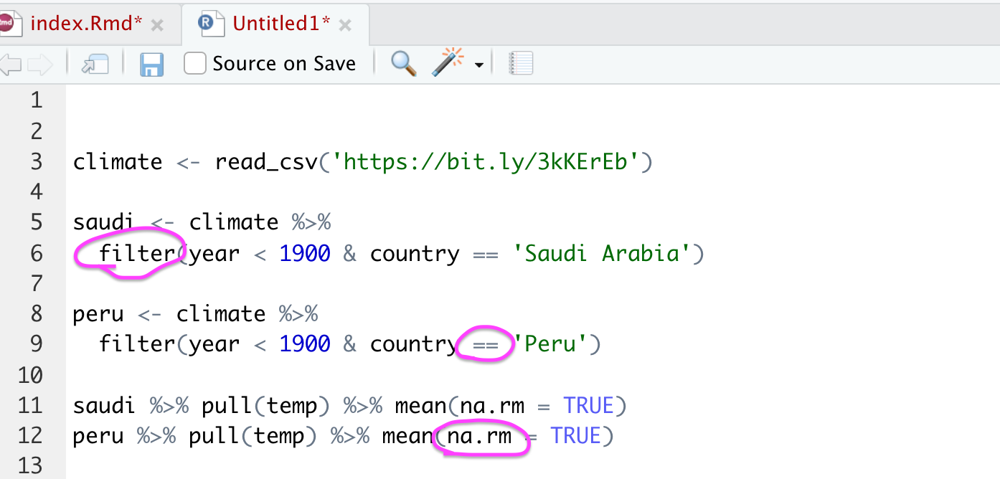

# Preamble

- Reminder: Submit 2 “stakeholder-ready” data visualizations on November 11 or before
- What are tibbles? Two-dimensional data just like Excel spreadsheets

```{r setup, include=FALSE}
library(tidyverse)
library(knitr)
library(countdown)
library(kableExtra)
library(formatR)
library(scales)
library(ggthemes)
options(scipen=999)

opts_chunk$set(warning=FALSE, message=FALSE)

airbnb <- read_csv('https://bit.ly/3oadz2L', col_types = cols())
climate <- read_csv('https://bit.ly/3kKErEb', col_types = cols())
```

---

# What we learned in the previous class

- A bit more about troubleshooting
- Chaining together functions with a pipe operator (`%>%`)
- Selecting, creating, and updating variables  
- Subsetting tibbles/data frames  
- Aggregation  

---

# What we'll learn today  

- Overview of ggplot2  
- Building bar, line, and scatter plots  
  - Aggregated data
  - Disaggregated data
- Customizing plots

---

# A reminder on troubleshooting

- Run code line by line  
- Ensure the code finished running (`+`s vs. `>`s in the R console)  
- Red "x" annotation beside line numbers (after saving your file)


---

# Troubleshooting exercise 

**Exercise 1 - 5 minutes**  

This code contains 4 mistakes. The code is supposed to report the mean, median, and max temperatures for Brazilian cities in the 19th and 20th centuries.      

--

```r
library(tidyverse)
        
climate <- read_csv('https://bit.ly/3kKErEb')

climate %>% 
  fitler(
    country == 'Brazil' 
    & ! is.na(temp) 
    & year < 2000
    ) %>% 
  mutate(century = ifese(year >= 1900, '20th Century', '19th Century')) %>% 
  group_by(century, city) %>% 
  summarise(
    mean_temp = mean(temp) 
    median_temp = median(temp)
    , max_temp = max(temp)
    ) 
  arrange(city)
```

```{r, echo = FALSE}
countdown(minutes = 5, seconds = 0)
```

---

# Troubleshooting exercise 

**Exercise 1 - 5 minutes**  

This code contains 4 mistakes. The code is supposed to report the mean, median, and max temperatures for Brazilian cities in the 19th and 20th centuries.      



---
class: inverse, middle, center

# Visualization with ggplot2

---

Import `airbnb` data if you have not already

```r
airbnb <- read_csv('https://bit.ly/3oadz2L')
```

---

# ggplot2

- Yardstick for plotting data in R  
- Part of the `tidyverse` collection of packages  
- Virtually no limits to plot types (when leveraging supplemental libraries)  
- Plotting resources  
  - [ggplot2 Launch Page](http://ggplot2.tidyverse.org/)
  - [Top 50 ggplot2 Visualizations](http://r-statistics.co/Top50-Ggplot2-Visualizations-MasterList-R-Code.html)

---

# Plot types


---

# Plot types


---

# Plot types


---

# Plot types

What we will learn

    

--

Requests to learn another plot type?

---

# Plot types

.pull-left[
1 discrete variable (plus optional discrete and/or continuous variables)  

   

1 continuous variable  

  
]

.pull-right[
2 continuous variables  

  

1 continuous variable + ordinal variable  

  
]

---

# Confirm that you can plot data 

```r
library(tidyverse)
mpg %>% ggplot() + geom_point(aes(displ, hwy))
```

--

```{r, echo = FALSE, collapse=TRUE, fig.height = 4, fig.width = 7, dpi=300}
mpg %>% ggplot() + geom_point(aes(displ, hwy))
```

---

# Confirm that you can plot data 

- If you see a plot, you're ready to go!  
- If you do not, reinstall `tidyverse` and re-run the test code

```r
install.packages('tidyverse')
library(tidyverse)
mpg %>% ggplot(aes(displ, hwy))) + geom_point()
```

--

- If it still didn't work, install `ggplot2` and re-run the test code  

```r
install.packages('ggplot2')
library(ggplot2)
mpg %>% ggplot(aes(displ, hwy)) + geom_point()
```

---

# How to plot data

1. Pick your data
2. Pick your chart type (geom)
3. Write code for stuff like chart titles, axis names, axis types, and legends (scales)  
4. Make it pretty (themes)
5. Keep tuning and reuse code

---

# Geoms

- Every plot needs a `ggplot()` function and a geom layer
- Separate layers and other plotting functions with `+`

```r
ggplot() + geom_bar()       # create bar and stacked bar plots
ggplot() + geom_histogram() # create histograms
ggplot() + geom_point()     # create scatter plots
ggplot() + geom_line()      # create line plots
```

--

- Your data is an argument in the `ggplot()` function  

```r
airbnb %>% ggplot() + geom_bar() # ggplot(data = airbnb) + geom_bar()
```

---

# Geoms

- Map your data to the plot with `aes()`
  - `aes()` maps the variables in your data to the plot
  - `aes()` can be an argument in `ggplot()` or the geom  
  - In simpler plots, `aes()` should go in `ggplot()`
  - Lots of `aes()` arguments

```r
airbnb %>% ggplot(aes()) + geom_bar()
airbnb %>% ggplot() + geom_bar(aes()) # Alternate placement of aes()
```

--

```r
aes(x = NULL, y = NULL, color = NULL
  , fill = NULL, alpha = NULL, label = NULL
  , shape = NULL, size = NULL, linetype = NULL
  )
```

---

# Geoms - Bar Plot

Map a character variable to `x`  

```{r, dpi=300, fig.height = 4, fig.width = 7, echo = TRUE, collapse=TRUE}
airbnb %>% ggplot(aes(x = address)) + geom_bar()
```

---

# Geoms - Bar Plot

Map a character variable to `x`...and to `fill`

```{r, dpi=300, fig.height = 4, fig.width = 7, echo = TRUE, collapse=TRUE}
airbnb %>% ggplot(aes(x = address, fill = address)) + geom_bar()
```

---

# Geoms - Bar Plot

Map a second character variable to `fill` to build a stacked bar plot

```{r, dpi=300, fig.height = 4, fig.width = 7, echo = TRUE, collapse=TRUE}
airbnb %>% ggplot(aes(x = address, fill = room_type)) + geom_bar()
```

---

# Geoms - Bar Plot

Other handy features when building bar plots  
- `stat` in `geom_bar()`: "count" vs. "identity" 
- `position`in `geom_bar()`: "stacked" vs. "dodge"
- `coord_flip()`
- `reorder()`
- arguments outside of `aes()`

.pull-left[
```r
airbnb %>% 
  ggplot(
    aes(
      x = address
      , fill = address
      )
    ) + 
  geom_bar()
```
]
.pull-right[
```{r, fig.show='hide'}
airbnb %>% 
  group_by(address) %>%   #<<
  summarise(n = n()) %>%   #<<
  ggplot(
    aes(
      x = address
      , y = n   #<<
      , fill = address
      )
    ) + 
  geom_bar(stat = 'identity')   #<<
```
]
  
---

# Geoms - Bar Plot

Other handy features when building bar plots  
- `stat` in `geom_bar()`: "count" vs. "identity" 
- `position`in `geom_bar()`: "stacked" vs. "dodge"
- `coord_flip()`
- `reorder()`
- arguments outside of `aes()`

```r
airbnb %>% 
  ggplot(aes(x = address, fill = room_type)) + 
  geom_bar(position = 'dodge')
```

--

```r
airbnb %>% 
  ggplot(aes(x = address, fill = room_type)) + 
  geom_bar() + 
  coord_flip()
```

---

# Geoms - Bar Plot

Other handy features when building bar plots  
- `stat` in `geom_bar()`: "count" vs. "identity" 
- `position`in `geom_bar()`: "stacked" vs. "dodge"
- `coord_flip()`
- `reorder()`
- arguments outside of `aes()`

```r
airbnb %>% 
  group_by(address) %>%   
  summarise(n = n()) %>%
  ggplot(
    aes(
      x = reorder(address, -n)
      , y = n  
      , fill = address
      )
    ) + 
  geom_bar(stat = 'identity') 
```

---

# Geoms - Bar Plot

Other handy features when building bar plots  
- arguments outside of `aes()`

```{r, fig.show='hide'}
my_data <- airbnb %>% 
  group_by(address) %>% 
  summarise(n = n())

mean_count <-  my_data %>%
  pull(n) %>% 
  mean()

my_data %>% 
  ggplot(
    aes(
      x = reorder(address, -n)
      , y = n  
      )
    ) + 
  geom_bar(
    stat = 'identity', fill = '#CC3F0C' # coolors.co/generate #<<
    , linetype = 'dashed', color = 'black', size = 1 #<<
    ) + 
  geom_hline(yintercept = mean_count, size = 1, color = '#FFBA08') #<<
```

---
# Geom - Bar Plot

- Build a bar chart with `climate` data that shows the number of rows for the following countries: 'Brazil', 'China', 'India', 'Turkey', and 'United States'
- To complete the task, you'll need to:
  - Subset your data using `filter()`
  - Aggregate your data using `group_by()` and `summarise()`
  - Set the color of the bars equal to `country`
  

```{r, echo = FALSE}
countdown(minutes = 7, seconds = 0)
```

---

# Geom - Bar Plot

Exercise - 7 minutes

- Build a bar chart with `climate` data that shows the number of rows for the following countries: 'Brazil', 'China', 'India', 'Turkey', and 'United States'
- To complete the task, you'll need to:
  - Subset your data using `filter()`
  - Aggregate your data using `group_by()` and `summarise()`
  - Set the color of the bars equal to `country`
  
```r
climate %>% 
  filter(country %in% c('Brazil', 'China', 'India', 'Turkey', 'United States')) %>% 
  group_by(country) %>% 
  summarise(n = n()) %>% 
  ggplot(aes(x = reorder(country, -n), y = n, fill = country)) + 
  geom_bar(stat = 'identity')
```

---

# Geom - Bar Plot

```{r,  fig.height = 5, fig.width = 12, dpi = 300, echo = TRUE, collapse=TRUE}
climate %>% 
  filter(country %in% c('Brazil', 'China', 'India', 'Turkey', 'United States')) %>% 
  group_by(country) %>% 
  summarise(n = n()) %>% 
  ggplot(aes(x = reorder(country, -n), y = n, fill = country)) + 
  geom_bar(stat = 'identity')
```

---
class: inverse, middle, center

# Scales

---

# Axis, legend, and chart titles

Axis names  

- Keep names short-ish  
- Consider including units in axis name  
- It is possible you don't need an axis name

2 options

```r
# Option 1
labs(x = 'X Axis Title', y = 'Y Axis Title')

# Option 2
xlab('X Axis Title')
ylab('Y Axis Title')
```

---

# Axis, legend, and chart titles

```{r, dpi=300, fig.height = 4, fig.width = 9, echo = TRUE, collapse=TRUE}
airbnb %>% 
  ggplot(aes(x = address, fill = room_type)) + 
  geom_bar() + 
  labs(x = 'City', y = 'Number of Rentals (#)')
```

---

# Axis, legend, and chart titles

Try adding axis names to the plot of countries made from the `climate` data

--

```{r,  fig.height = 5, fig.width = 13, dpi = 300, echo = TRUE, collapse=TRUE}
climate %>% 
  filter(country %in% c('Brazil', 'China', 'India', 'Turkey', 'United States')) %>% 
  group_by(country) %>% 
  summarise(n = n()) %>% 
  ggplot(aes(x = reorder(country, -n), y = n, fill = country)) + 
  geom_bar(stat = 'identity') + 
  labs(x = 'Country', y = 'Number of Countries (#)')
```

---

# Axis, legend, and chart titles

Legend names  

- Keep names short  
- Be mindful of what the legend is for
  - Color? Fill? Size? etc.
- Consider hiding the legend title for a clean look  

```r
labs(fill = '')
labs(fill = element_blank())
labs(fill = NULL)
labs(colour = 'Check out these colors')
```

---

# Axis, legend, and chart titles

```{r, dpi=300, fig.height = 4, fig.width = 9, echo = TRUE, collapse=TRUE}
airbnb %>% 
  ggplot(aes(x = address, fill = room_type)) + 
  geom_bar() + 
  labs(x = 'City', y = 'Number of Rentals (#)', fill = 'Check out these colors')
```

---

# Axis, legend, and chart titles 

Try removing the legend name from the plot of countries made from the `climate` data

--

```{r, fig.height = 5, fig.width = 13, dpi = 300, echo = TRUE, collapse=TRUE}
climate %>% 
  filter(country %in% c('Brazil', 'China', 'India', 'Turkey', 'United States')) %>% 
  group_by(country) %>% 
  summarise(n = n()) %>% 
  ggplot(aes(x = reorder(country, -n), y = n, fill = country)) + 
  geom_bar(stat = 'identity') + 
  labs(x = 'Country', y = 'Number of Observations (#)', fill = element_blank())
```

---

# Axis, legend, and chart titles 

Chart titles and subtitles

- Consider making titles (or subtitles) descriptive
- Don't over use subtitles

```r
# Option 1
labs(title = NULL, subtitle = NULL)

# Option 2
ggtitle(title = NULL, subtitle = NULL)
```

---

# Axis, legend, and chart titles

```r
airbnb %>% 
  ggplot(aes(x = address, fill = room_type)) + 
  geom_bar() + 
  labs(
    x = 'City'
    , y = 'Number of Rentals (#)'
    , fill = 'Check out these colors'
    , title    = 'Room Types by City'
    , subtitle = 'Shared Rooms are the Least Available Room Type'
    )
```

---

# Axis, legend, and chart titles

```{r, dpi=300, fig.height = 4, fig.width = 9, echo = FALSE}
airbnb %>% 
  ggplot(aes(x = address, fill = room_type)) + 
  geom_bar() + 
  labs(
    x = 'City'
    , y = 'Number of Rentals (#)'
    , fill = 'Check out these colors'
    , title    = 'Room Types by City'
    , subtitle = 'Shared Rooms are the Least Available Room Type'
    )
```

---

# Axis, legend, and chart titles

Try adding a title to the plot of countries made from the `climate` data

--

```r
climate %>% 
  filter(country %in% c('Brazil', 'China', 'India', 'Turkey', 'United States')) %>% 
  group_by(country) %>% 
  summarise(n = n()) %>% 
  ggplot(aes(x = reorder(country, -n), y = n, fill = country)) + 
  geom_bar(stat = 'identity') + 
  labs(
    x = 'Country'
    , y = 'Number of Observations (#)'
    , fill = element_blank()
    , title = 'Number of observations by country'
    )
```

---

# Axis, legend, and chart titles

Try adding a title to the plot of countries made from the `climate` data

```{r, fig.height = 5, fig.width = 13, dpi = 300, echo = FALSE}
climate %>% 
  filter(country %in% c('Brazil', 'China', 'India', 'Turkey', 'United States')) %>% 
  group_by(country) %>% 
  summarise(n = n()) %>% 
  ggplot(aes(x = reorder(country, -n), y = n, fill = country)) + 
  geom_bar(stat = 'identity') + 
  labs(x = 'Country', y = 'Number of Observations (#)', fill = element_blank()
       , title = 'Number of observations by country')
```

---

# Axis units

- Change axis units
- This is a good idea and you should do it when its relevant
- Good for x and y axes

```r
install.packages('scales')
library(scales)

scale_y_continuous(labels = percent) # Add a percentage sign to numbers on axis
scale_y_continuous(labels = dollar)  # Add a dollar sign to numbers on axis
scale_y_continuous(labels = comma)   # Add a comma to numbers on axis
```

---

# Axis units

```r
airbnb %>% 
  ggplot(aes(x = address, fill = room_type)) + 
  geom_bar() + 
  labs(
    x = 'City'
    , y = 'Number of Rentals (#)'
    , fill = 'Check out these colors'
    , title    = 'Room Types by City'
    , subtitle = 'Shared Rooms are the Least Available Room Type'
    ) + 
  scale_y_continuous(labels = comma) 
```

---

# Axis units

```{r, dpi=300, fig.height = 4, fig.width = 9, echo = FALSE}
airbnb %>% 
  ggplot(aes(x = address, fill = room_type)) + 
  geom_bar() + 
  labs(
    x = 'City'
    , y = 'Number of Rentals (#)'
    , fill = 'Check out these colors'
    , title    = 'Room Types by City'
    , subtitle = 'Shared Rooms are the Least Available Room Type'
    ) + 
  scale_y_continuous(labels = comma) 
```

---

# Axis units

Try adding commas to the y-axis of the plot you made from the `climate` data

--

```r
climate %>% 
  filter(country %in% c('Brazil', 'China', 'India', 'Turkey', 'United States')) %>% 
  group_by(country) %>% 
  summarise(n = n()) %>% 
  ggplot(aes(x = reorder(country, -n), y = n, fill = country)) + 
  geom_bar(stat = 'identity') + 
  labs(
    x = 'Country'
    , y = 'Number of Observations (#)'
    , fill = element_blank()
    , title = 'Number of observations by country'
    ) + 
  scale_y_continuous(labels = comma) 
```

---

# Axis units

Try adding commas to the y-axis of the plot you made from the `climate` data

```{r, fig.height = 5, fig.width = 13, dpi = 300, echo = FALSE}
climate %>% 
  filter(country %in% c('Brazil', 'China', 'India', 'Turkey', 'United States')) %>% 
  group_by(country) %>% 
  summarise(n = n()) %>% 
  ggplot(aes(x = reorder(country, -n), y = n, fill = country)) + 
  geom_bar(stat = 'identity') + 
  labs(x = 'Country', y = 'Number of Observations (#)', fill = element_blank()
       , title = 'Number of observations by country') + 
  scale_y_continuous(labels = comma) 
```

---
class: inverse, middle, center

# Themes

---

# Themes

- Change layer and background colors
- Change fonts
- Change plot borders/boundaries and ticks
- Pre-built themes vs. custom themes
  - `ggplot2` themes
  - `ggthemes` themes

```r
install.packages('ggthemes')
library(ggthemes)
```

---

# Pre-built themes

Selected `ggplot2` themes

```r
theme_classic()
theme_bw()
theme_minimal()
theme_dark()
```  
Selected `ggthemes` themes

```r
theme_stata() + scale_colour_stata() # also can use scale_fill_stata()
theme_economist() + scale_colour_economist() 
theme_fivethirtyeight() + scale_color_fivethirtyeight() 
theme_wsj() + scale_colour_wsj() 
theme_pander() + scale_colour_pander() 
theme_hc(bgcolor = "darkunica") + scale_colour_hc("darkunica") 
```

---

# Pre-built themes

```r
airbnb %>% 
  ggplot(aes(x = address, fill = room_type)) + 
  geom_bar() + 
  labs(
    x = 'City'
    , y = 'Number of Rentals (#)'
    , fill = 'Check out these colors'
    , title    = 'Room Types by City'
    , subtitle = 'Shared Rooms are the Least Available Room Type'
    ) + 
  scale_y_continuous(labels = comma) + 
  theme_economist() + 
  scale_fill_economist()
```

---

# Pre-built themes

Economist theme  
  
```{r, dpi=300, fig.height = 4, fig.width = 9, echo = FALSE}
airbnb %>% 
  ggplot(aes(x = address, fill = room_type)) + 
  geom_bar() + 
  labs(
    x = 'City'
    , y = 'Number of Rentals (#)'
    , fill = 'Check out these colors'
    , title    = 'Room Types by City'
    , subtitle = 'Shared Rooms are the Least Available Room Type'
    ) + 
  scale_y_continuous(labels = comma) +
  theme_economist() + 
  scale_fill_economist()
```

---

# Pre-built themes

  

---

# Pre-built themes

Try adding a theme to the plot you made from the `climate` data

--

```r
climate %>% 
  filter(country %in% c('Brazil', 'China', 'India', 'Turkey', 'United States')) %>% 
  group_by(country) %>% 
  summarise(n = n()) %>% 
  ggplot(aes(x = reorder(country, -n), y = n, fill = country)) + 
  geom_bar(stat = 'identity') + 
  labs(
    x = 'Country'
    , y = 'Number of Observations (#)'
    , fill = element_blank()
    , title = 'Number of observations by country'
    ) + 
  scale_y_continuous(labels = comma) +
  theme_wsj() + 
  scale_fill_wsj()
```

---

# Pre-built themes

Try adding a theme to the plot you made from the `climate` data

```{r, fig.height = 5, fig.width = 13, dpi = 300, echo = FALSE}
climate %>% 
  filter(country %in% c('Brazil', 'China', 'India', 'Turkey', 'United States')) %>% 
  group_by(country) %>% 
  summarise(n = n()) %>% 
  ggplot(aes(x = reorder(country, -n), y = n, fill = country)) + 
  geom_bar(stat = 'identity') + 
  labs(
    x = 'Country'
    , y = 'Number of Observations (#)'
    , fill = element_blank()
    , title = 'Number of observations by country'
    ) + 
  scale_y_continuous(labels = comma) +
  theme_wsj() + 
  scale_fill_wsj()
```

---

# Custom themes

- You can create custom themes with `theme()`
- Greater control over chart aesthestics
- Use custom themes in place of pre-built themes if pre-built themes don't cut it
- Also, use custom themes to augment pre-built themes

---

# Custom themes

```r
theme(
  plot.title         = element_text(size=14, face="bold", vjust=1)
  , plot.background  = element_blank()
  , panel.grid.major = element_blank()
  , panel.grid.minor = element_blank()
  , panel.border     = element_blank()
  , panel.background = element_blank()
  , axis.ticks       = element_blank()
  , axis.text        = element_text(colour="black", size=12)
  , axis.text.x      = element_text(angle=45, hjust=1)
  , legend.title     = element_blank()
  , legend.position  = "none"
  , legend.text      = element_text(size=12)
  )
  
help(theme)
```

---

# Exercise - 7 minutes

The code on the right is the solution to the troubleshooting question from the beginning of class. 

.pull-left[
- Visualize the data as a bar plot
- The x-axis should equal `city`
- The y-axis should equal `mean_temp`
- `fill` should be `century`
- Dodge the bar segments
- Feel free to use a theme, title the plot, update axis titles, or make an other aesthetic changes
]

.pull-right[
```r
climate %>% 
  filter(
    country == 'Brazil' 
    & ! is.na(temp) 
    & year < 2000
  ) %>% 
  mutate(century = ifelse(year >= 1900, '20th Century', '19th Century')) %>% 
  group_by(century, city) %>%   
  summarise(
    mean_temp = mean(temp) 
    , median_temp = median(temp)
    , max_temp = max(temp)
  ) %>% 
  arrange(city)
```
]

```{r, echo = FALSE}
countdown(minutes = 7, seconds = 0, left = 0)
```

---

# Exercise - 7 minutes

```r
climate %>% 
  filter(
    country == 'Brazil' 
    & ! is.na(temp) 
    & year < 2000
  ) %>% 
  mutate(century = ifelse(year >= 1900, '20th Century', '19th Century')) %>% 
  group_by(century, city) %>%   
  summarise(
    mean_temp = mean(temp) 
    , median_temp = median(temp)
    , max_temp = max(temp)
  ) %>% 
  arrange(city) %>% 
  ggplot(aes(x = reorder(city, mean_temp), y = mean_temp, fill = century)) + 
  geom_bar(stat = 'identity', position = 'dodge') + 
  labs(x = 'City', y = 'Mean Temperature (Celcius)', fill = NULL) + 
  theme_hc() + 
  scale_fill_hc()
```

---

# Exercise - 7 minutes

```{r,  fig.height = 5, fig.width = 13, dpi = 300, echo = FALSE}
climate %>% 
  filter(
    country == 'Brazil' 
    & ! is.na(temp) 
    & year < 2000
  ) %>% 
  mutate(century = ifelse(year >= 1900, '20th Century', '19th Century')) %>% 
  group_by(century, city) %>%   
  summarise(
    mean_temp = mean(temp) 
    , median_temp = median(temp)
    , max_temp = max(temp)
  ) %>% 
  arrange(city) %>% 
  ggplot(aes(x = reorder(city, mean_temp), y = mean_temp, fill = century)) + 
  geom_bar(stat = 'identity', position = 'dodge') + 
  labs(x = 'City', y = 'Mean Temperature (Celcius)', fill = NULL) + 
  theme_hc() + 
  scale_fill_hc()
```

---
class: inverse, middle, center

# Histograms, scatterplots, and line plots

---

# 

.pull-left[
Line plot: 1 continuous variable + ordinal variable   

- Line plots are suited well to [dates](https://gbearden.github.io/r_course_evans_school/slides/part_2/#71), but may work well other ordered variables
- `color` and `linetype` are other arguments you can use when building a line plot

```r
climate %>% 
  group_by(year) %>%
  summarise(uncertainty = mean(uncertainty, na.rm = TRUE)) %>% 
  ggplot(aes(x = year, y = uncertainty)) +
  geom_line()
```
]

.pull-right[
```{r, dpi = 300, fig.height = 3, fig.width = 5, echo = FALSE, warning=FALSE, message=FALSE}
climate %>% 
  group_by(year) %>%
  summarise(uncertainty = mean(uncertainty, na.rm = TRUE)) %>% 
  ggplot(aes(x = year, y = uncertainty)) +
  geom_line()
```
]

---

# 

.pull-left[
Line plot: 1 continuous variable + ordinal variable   

- Line plots are suited well to [dates](https://gbearden.github.io/r_course_evans_school/slides/part_2/#71), but may work well other ordered variables
- `color` and `linetype` are other arguments you can use when building a line plot

```r
climate %>% 
  group_by(year) %>%
  summarise(uncertainty = mean(uncertainty, na.rm = TRUE)) %>% 
  ggplot(aes(x = year, y = uncertainty)) +
  geom_line()
```
]

.pull-right[
How would you make the line red? 

```{r, dpi = 300, fig.height = 3, fig.width = 5, echo = FALSE, warning=FALSE, message=FALSE}
climate %>% 
  group_by(year) %>%
  summarise(uncertainty = mean(uncertainty, na.rm = TRUE)) %>% 
  ggplot(aes(x = year, y = uncertainty)) +
  geom_line()
```
]

---

# 


.pull-left[
Scatterplots: 2 continuous variables 

- When there are a lot of overlapping data, `alpha` is useful
- `color`, `shape`, `size` are other arguments you can use when building a scatter plot

```r
climate %>% 
  ggplot(
    aes(
      x = temp
      , y = uncertainty
      )
    ) + 
  geom_point(alpha = .1)
```
]

.pull-right[
```{r, dpi = 300, fig.height = 3, fig.width = 5, echo = FALSE, warning=FALSE, message=FALSE}
climate %>% 
  ggplot(
    aes(
      x = temp
      , y = uncertainty
      )
    ) + 
  geom_point(alpha = .1)
```
]

---

# 


.pull-left[
Scatterplots: 2 continuous variables 

- When there are a lot of overlapping data, `alpha` is useful
- `color`, `shape`, `size` are other arguments you can use when building a scatter plot

```r
climate %>% 
  ggplot(
    aes(
      x = temp
      , y = uncertainty
      )
    ) + 
  geom_point(alpha = .1)
```
]

.pull-right[
Take a moment to create a scatterplot with `year` and `uncertainty` from `climate`
]

---

# 

.pull-left[
Histograms: 1 continuous variable  

- `bins` is the argument you use to indicate the number of columns in your histogram

```{r, dpi = 300, fig.height = 3, fig.width = 5, echo = TRUE, collapse=TRUE, warning=FALSE, message=FALSE}
climate %>% 
  ggplot(aes(uncertainty)) + 
  geom_histogram(bins = 10) 
```
]

--

.pull-right[
Take a moment to create a histogram with any continuous variable from either `climate` or `airbnb`
]

---

# Exercise - 15 minutes

- With `climate`, create a line plot of mean Fahrenheit temperatures for cities in Brazil
  - Data should be for 1850 and onward
  - Make line color equal to `city`
  - Use the following formula to convert Celcius to Fahrenheit: `(temp * 9/5) + 32`
  - Create the mean temperature with `summarise` and call it `mean_temp` 
  - Feel free to change plot aesthetics as you see fit (add a theme; change axis, legend, or plot titles; change the color of lines for cities; etc.)

```{r, echo = FALSE}
countdown(minutes = 15, seconds = 0)
```

--

```r
climate %>% 
  filter() %>% 
  group_by() %>% 
  summarise()
```

---

# Exercise - 15 minutes

```r
climate %>% 
  filter(country == 'Brazil' & year >= 1850) %>% 
  mutate(temp = (temp * 9/5) + 32) %>% 
  group_by(year, city) %>% 
  summarise(mean_temp = mean(temp, na.rm = TRUE)) %>% 
  ggplot(aes(x = year, y = mean_temp, color = city)) + 
  geom_line(size = 1) + 
  theme_bw() + 
  ggthemes::scale_color_wsj() + 
  labs(
    x = 'Year'
    , y = 'Mean Temperature'
    , title = 'Temperatures in 6 Brazilian Cities, 1850 - present'
    , color = NULL
  )
```

---

# Exercise - 15 minutes

```{r, dpi = 300, fig.height = 4, fig.width = 6, echo = FALSE, warning=FALSE, message=FALSE}
climate %>% 
  filter(country == 'Brazil' & year >= 1850) %>% 
  mutate(temp = (temp * 9/5) + 32) %>% 
  group_by(year, city) %>% 
  summarise(mean_temp = mean(temp, na.rm = TRUE)) %>% 
  ggplot(aes(x = year, y = mean_temp, color = city)) + 
  geom_line(size = 1) + 
  theme_bw() + 
  ggthemes::scale_color_wsj() + 
  labs(
    x = 'Year'
    , y = 'Mean Temperature'
    , title = 'Temperatures in 6 Brazilian Cities, 1850 - present'
    , color = NULL
  )
```

---

# Exercise - 7 minutes

- With `airbnb`, create a scatterplot that plots two numeric variables  
- In addition to `x` and `y`, include another argument in `aes()`
   - For example, `size`, `shape`, `color` or `alpha`  
- Use `group_by()` and `summarise()` if you would like  
- Feel free to subset your data with `filter` or `sample_n()`

```{r, echo = FALSE}
countdown(minutes = 7, seconds = 0)
```

---

# Exercise - 7 minutes

```{r, dpi = 300, fig.height = 4, fig.width = 7, echo = FALSE, warning=FALSE, message=FALSE}
airbnb %>% 
  ggplot(aes(x = longitude, y = latitude, color = address)) + 
  geom_point(alpha = .6) + 
  theme_bw() + 
  labs(
    x = 'Longitude'
    , y = 'Latitude'
    , color = 'City'
    , title = 'Coordinates of Seattle-area Airbnbs'
  )
```

---

# Exercise - 7 minutes

```r
airbnb %>% 
  ggplot(aes(x = longitude, y = latitude, color = address)) + 
  geom_point(alpha = .6) + 
  theme_bw() + 
  labs(
    x = 'Longitude'
    , y = 'Latitude'
    , color = 'City'
    , title = 'Coordinates of Seattle-area Airbnbs'
  )
```
