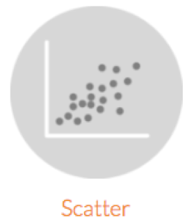

```{css, echo=FALSE}
.small { font-size: 90% }
.smaller { font-size: 80% }
```

```{r setup, include=FALSE}
library(tidyverse)
library(knitr)
library(countdown)
library(kableExtra)
library(formatR)
library(scales)
library(ggthemes)
options(scipen=999)

opts_chunk$set(warning=FALSE, message=FALSE)

extra_css <- list(
  ".small" = list("font-size" = "90%"),
  ".smaller" = list("font-size" = "80%")
  )

xaringanthemer::style_extra_css(css = extra_css, outfile = "custom.css")

wacky_palette <- c("#FF0099", "#00CCFF", "#FF9900", "#33FF33", "#FF33CC", "#FFFF66", "#6600CC")

airbnb <- read_csv('https://bit.ly/3oadz2L', col_types = cols())
climate <- read_csv('https://bit.ly/3kKErEb', col_types = cols())
checkin <- read_csv('https://bit.ly/3nQHlI0', col_types = cols())
mba <- read_csv("https://bit.ly/4evYpeW", col_types = cols())
```

# Housekeeping

- Reminder: Submit 2 “stakeholder-ready” data visualizations and your code on November 3 or before  
  - The assignment has been added to Canvas
  - See examples [here](https://github.com/gbearden/r_course_evans_school/blob/master/plots/) on Github  
- What does "Stakeholder-ready" mean?  
  - Write a plot title
  - Label the axes 
  - Use a theme
  - Do not include `NA`s in the plot (geom or legend)  
- Datasets  
  - [Kaggle](https://www.kaggle.com/datasets)
  - [Data.gov](https://www.data.gov/)
  - [Washington Post](https://github.com/orgs/washingtonpost/repositories?language=&q=data&sort=&type=)
  - [fivethirtyeight](https://data.fivethirtyeight.com/)  
  - [Awesome Public Datasets on Github](https://github.com/awesomedata/awesome-public-datasets)
  - [BuzzFeed](https://github.com/BuzzFeedNews)  
  - [Google Dataset Search](https://datasetsearch.research.google.com/)
  - BONUS dataset: [Great British Bakeoff](https://github.com/apreshill/bakeoff)  

---

# Housekeeping

- Stay in touch! 
  - Feel free to connect with me on LinkedIn
  - Discussing data science/analytics careers

**Data for class**  
```r
airbnb <- read_csv('https://bit.ly/3oadz2L')
climate <- read_csv('https://bit.ly/3kKErEb')
mba <- read_csv("https://bit.ly/4evYpeW")
```

---

# What we learned in the previous class

- Overview of ggplot2  
- Building bar plots
  - Aggregated data
  - Disaggregated data
- Customizing plots
  - Adding themes, titles, and scales to plots

---

# What we'll learn today  

- Running code in an R Notebook
- Build line and scatter plots  
- Pivoting data   
- More ways to use logical conditions for filtering and changing variable values

---

# A few reminders

- Run code line by line  
- Ensure the code finished running (`+`s vs. `>`s in the R console)  
- Red "x" annotation beside line numbers (after saving your file)


---

# A few reminders

```r
# Use %in% to include multiple countries in your subsetted data
# Example 1
climate %>% 
  filter(country %in% c('Brazil', 'China', 'India', 'Turkey', 'United States'))

# Example 2
countries <- c('Brazil', 'China', 'India', 'Turkey', 'United States')
climate %>% 
  filter(country %in% countries)

# Use == to include one country in your subsetted data  
# Example 3
climate %>% 
  filter(country == "Brazil")
  
# Example 4
one_country <- "Brazil"
climate %>% 
  filter(country == one_country)
```

---

# A few reminders

```r
# stat = "count"
airbnb %>% 
  ggplot(
    aes(
      x = address,
      fill = address
      )
    ) + 
  geom_bar()
  
# stat = "identity"
airbnb %>% 
  group_by(address) %>% 
  summarise(count = n()) %>%
  ggplot(
    aes(
      x = address,
      y = count,
      fill = address
      )
    ) + 
  geom_bar(stat = 'identity')
```

---

# Warm up Exercise - MBA admissions

Create a stacked bar plot from the UPenn MBA admissions data that shows the number of non-international students by work industry. 

- Stacked bar segments should be mapped to a new variable that indicates whether a GMAT score is high or low. You can decide the threshold for what's "high" and "low"
- Use `reorder()` to sort the bars. Remember that when sorting (or reordering) bars you need to aggregate the data with `group_by()` and `summarise()` before creating the plot  
- Don't forget to use `filter()` to exclude international students 
- Update plot and axis titles and use a theme if you have time

```r
mba <- read_csv("https://bit.ly/4evYpeW")
```

```{r, echo = FALSE}
countdown(minutes = 7, seconds = 0, left = 0)
```

---

# Warm up Exercise - MBA admissions

Create a stacked bar plot from the UPenn MBA admissions data that shows the number of non-international students by work industry. 

```r
mba %>%
  filter(international == FALSE) %>% 
  mutate(high_gmat = if_else(gmat > 650, "High GMAT Score", "Low GMAT Score")) %>% 
  group_by(work_industry, high_gmat) %>% 
  summarise(n = n(), .groups = "drop")  
```

---

# Warm up Exercise - MBA admissions

Create a stacked bar plot from the UPenn MBA admissions data that shows the number of non-international students by work industry. 

```r
mba %>%
  filter(international == FALSE) %>% 
  mutate(high_gmat = if_else(gmat > 650, "High GMAT Score", "Low GMAT Score")) %>% 
  group_by(work_industry, high_gmat) %>% 
  summarise(n = n(), .groups = "drop") %>% 
  ggplot(aes(y = reorder(work_industry, n), x = n, fill = high_gmat)) +
  geom_bar(stat = "identity") + 
  labs(fill = NULL) + 
  theme_fivethirtyeight() + 
  scale_fill_fivethirtyeight()
```

---
class: inverse, middle, center

# Scatterplots and line plots

---

# 

.pull-left[
Line plot: 1 continuous variable + ordinal variable   

- Line plots are suited well to dates, but may work well other ordered variables
- `color` and `linetype` are other arguments you can use when building a line plot

```r
climate %>% 
  group_by(year) %>%
  summarise(uncertainty = mean(uncertainty, na.rm = TRUE)) %>% 
  ggplot(aes(x = year, y = uncertainty)) +
  geom_line()
```
]

.pull-right[
```{r, dpi = 300, fig.height = 3, fig.width = 5, echo = FALSE, warning=FALSE, message=FALSE}
climate %>% 
  group_by(year) %>%
  summarise(uncertainty = mean(uncertainty, na.rm = TRUE)) %>% 
  ggplot(aes(x = year, y = uncertainty)) +
  geom_line()
```
]

---

# 

.pull-left[
Line plot: 1 continuous variable + ordinal variable   

- Line plots are suited well to dates, but may work well other ordered variables
- `color` and `linetype` are other arguments you can use when building a line plot

```r
climate %>% 
  group_by(year) %>%
  summarise(uncertainty = mean(uncertainty, na.rm = TRUE)) %>% 
  ggplot(aes(x = year, y = uncertainty)) +
  geom_line()
```
]

.pull-right[
How would you make the line red? 

```{r, dpi = 300, fig.height = 3, fig.width = 5, echo = FALSE, warning=FALSE, message=FALSE}
climate %>% 
  group_by(year) %>%
  summarise(uncertainty = mean(uncertainty, na.rm = TRUE)) %>% 
  ggplot(aes(x = year, y = uncertainty)) +
  geom_line()
```
]

---

# 


.pull-left[
Scatterplots: 2 continuous variables 

- When there are a lot of overlapping data, `alpha` is useful
- `color`, `shape`, `size` are other arguments you can use when building a scatter plot

```r
climate %>% 
  ggplot(
    aes(
      x = temp
      , y = uncertainty
      )
    ) + 
  geom_point(alpha = .1)
```
]

.pull-right[
```{r, dpi = 300, fig.height = 3, fig.width = 5, echo = FALSE, warning=FALSE, message=FALSE}
climate %>% 
  ggplot(
    aes(
      x = temp
      , y = uncertainty
      )
    ) + 
  geom_point(alpha = .1)
```
]

---

# 


.pull-left[
Scatterplots: 2 continuous variables 

- When there are a lot of overlapping data, `alpha` is useful
- `color`, `shape`, `size` are other arguments you can use when building a scatter plot

```r
climate %>% 
  ggplot(
    aes(
      x = temp
      , y = uncertainty
      )
    ) + 
  geom_point(alpha = .1)
```
]

.pull-right[
Take a moment to create scatterplots with (a) `gpa` and `gmat` from `mba` and (b) `year` and `uncertainty` from `climate`
]

---

# Exercise

- With `airbnb`, create a scatterplot that plots two numeric variables  
- In addition to `x` and `y`, include another argument in `aes()`
   - For example, `size`, `shape`, `color` or `alpha`  
- Use `group_by()` and `summarise()` if you would like  
- Feel free to subset your data with `filter` or `sample_n()`

```{r, echo = FALSE}
countdown(minutes = 7, seconds = 0, left = 0)
```

---

# Exercise

```{r, dpi = 300, fig.height = 4, fig.width = 7, echo = FALSE, warning=FALSE, message=FALSE}
airbnb %>% 
  ggplot(aes(x = longitude, y = latitude, color = address)) + 
  geom_point(alpha = .6) + 
  theme_bw() + 
  labs(
    x = 'Longitude'
    , y = 'Latitude'
    , color = 'City'
    , title = 'Coordinates of Seattle-area Airbnbs'
  )
```

---

# Exercise

```r
airbnb %>% 
  ggplot(aes(x = longitude, y = latitude, color = address)) + 
  geom_point(alpha = .6) + 
  theme_bw() + 
  labs(
    x = 'Longitude'
    , y = 'Latitude'
    , color = 'City'
    , title = 'Coordinates of Seattle-area Airbnbs'
  )
```

---

# Exercise

- With `climate`, create a line plot of mean Fahrenheit temperatures for cities in Brazil
  - Data should be for 1850 and onward ([help](https://gbearden.github.io/r_course_evans_school/slides/part_2/#44))  
  - Use the following formula to convert Celsius to Fahrenheit: `(temp * 9/5) + 32` ([help](https://gbearden.github.io/r_course_evans_school/slides/part_2/#28))  
  - Create the mean temperature with `summarise` and call it `mean_temp` ([help](https://gbearden.github.io/r_course_evans_school/slides/part_3/#33))  
  - Make line color equal to `city`
  - Feel free to change plot aesthetics as you see fit (add a theme; change axis, legend, or plot titles; change the color of lines for cities; etc.)  
  - *Click forward once for a hint on the functions required to prepare the data*  
  - *Click forward twice to see the plot you'll create*

```{r, echo = FALSE}
countdown(minutes = 15, seconds = 0, left = 0)
```

--

```r
climate %>% 
  filter() %>% 
  mutate() %>% 
  group_by() %>% 
  summarise()
```

---

# Exercise

```{r, dpi = 300, fig.height = 4, fig.width = 6, echo = FALSE, warning=FALSE, message=FALSE}
climate %>% 
  filter(country == 'Brazil' & year >= 1850) %>% 
  mutate(temp = (temp * 9/5) + 32) %>% 
  group_by(year, city) %>% 
  summarise(mean_temp = mean(temp, na.rm = TRUE)) %>% 
  ggplot(aes(x = year, y = mean_temp, color = city)) + 
  geom_line(size = 1) + 
  theme_bw() + 
  scale_color_wsj() + 
  labs(
    x = 'Year'
    , y = 'Mean Temperature'
    , title = 'Temperatures in 6 Brazilian Cities, 1850 - present'
    , color = NULL
  )
```

---

# Exercise

```r
climate %>% 
  filter(country == 'Brazil' & year >= 1850) %>% 
  mutate(temp = (temp * 9/5) + 32) %>% 
  group_by(year, city) %>% 
  summarise(mean_temp = mean(temp, na.rm = TRUE)) %>% 
  ggplot(aes(x = year, y = mean_temp, color = city)) + 
  geom_line(size = 1) + 
  theme_bw() + 
  scale_color_wsj() + 
  labs(
    x = 'Year'
    , y = 'Mean Temperature'
    , title = 'Temperatures in 6 Brazilian Cities, 1850 - present'
    , color = NULL
  )
```

---
class: inverse, middle, center

# Special Request: Maps

---

# Special Request: Maps

- Create maps with `ggmap` and `sf`
- Both libraries work well with tidyverse
- We'll use `ggmap` today because it's easy to get started 
  - Use APIs to import maps data from Google, Stadia Maps, and other soureces 
- Use `sf` if you plan to do more geospatial analysis   
  - Utilize shapefiles, geojson, and other geographic data files

```r
# Install libraries
install.packages(c("ggmap", "ggdensity", "sf"))
```

---

# Special Request: Maps

**Getting started**  

- Create [Stadia Maps](stadiamaps.com) account
- Create a [project](https://client.stadiamaps.com/dashboard/#/property/create)
- Connect R to Stadia Maps and produce a map of the U District

```r
library(ggmap)
# Copy and paste the API key from Stadia into RStudio
my_api_key <- "API KEY"
# Register your account in RStudio 
ggmap::register_stadiamaps(my_api_key)
# Test your registration by running the code below
# ggmap(map) should produce a map of the U District
corners <- c(left = -122.32205491677988, bottom = 47.64477492507337, right = -122.28675728039181, top = 47.66543531649921)
map <- get_stadiamap(bbox = corners, maptype = "stamen_toner_lite", zoom = 14)
ggmap(map)
```

---

# Special Request: Maps

```r
# Load the necessary libraries for density plotting and spatial visualization.
library(ggdensity)  # Provides tools for high-density region visualization.
library(ggmap)      # Allows for spatial data overlays on static maps.

# Register the Stadia Maps API key to enable map retrieval.
my_api_key <- "API KEY"
ggmap::register_stadiamaps(my_api_key)

# Prepare Airbnb data by renaming latitude and longitude columns.
# This makes it easier to reference these columns in mapping functions.
airbnb_geo <- airbnb %>% 
  rename(lat = latitude, lon = longitude)

# Define the bounding box (bbox) for the map based on Airbnb data.
# The bbox will specify the geographic area to be visualized.
bbox <- make_bbox(lon, lat, data = airbnb_geo)

# Fetch the base map from Stadia Maps using the bounding box and a specified map style.
# Zoom level controls how close the map will be. A higher zoom gives a more detailed view.
map <- get_stadiamap(bbox = bbox, maptype = "stamen_toner_lite", zoom = 14)
```

---

# Special Request: Maps

```r
# Create a scatter plot map with Airbnb points.
# Each point represents an Airbnb listing, and points are colored by room type.
points_map <- ggmap(map) + 
  geom_point(data = airbnb_geo, aes(color = room_type), alpha = .5) + 
  scale_color_manual(values = wacky_palette[1:3]) +
  labs(color = NULL) + 
  theme_void() + 
  theme(legend.position = "top")
```

---

# Special Request: Maps

```r
# Create a high-density region (HDR) map.
# This shows areas with a high concentration of Airbnb listings as filled regions.
hdr_map <- ggmap(map) + 
  geom_hdr(
    data = airbnb_geo,
    aes(lon, lat, fill = after_stat(probs)),
    alpha = .5
  ) +
  scale_fill_manual(values = wacky_palette[1:4]) +
  labs(fill = NULL) + 
  theme_void() + 
  theme(legend.position = "none")
```

---

# Maps Exercise 

Create a point or HRD map using the crime data below. Before creating the map, subset the data by `event_clearance_date` and any of the `event_clearance_*` variables. Use `make_bbox()` and `get_stadiomaps()` and then create a map with `ggmap() + geom_point()` or `ggmap() + geom_hdr()`.

```r
crime <- read_csv("https://bit.ly/3NERxk6") %>% 
  transmute(
    general_offense_number,
    event_clearance_description,
    event_clearance_subgroup,
    event_clearance_group,
    event_clearance_date,
    lon = longitude,
    lat = latitude
    )
```

```{r, echo = FALSE}
countdown(minutes = 7, seconds = 0, left = 0)
```

---

# Maps Exercise 

```r
crime_2 <- crime %>% 
  filter(
    event_clearance_date <= "2015-01-01"
    & event_clearance_group == "LIQUOR VIOLATIONS"
)

bbox <- make_bbox(lon, lat, data = crime_2)
map <- get_stadiamap(bbox = bbox, maptype = "stamen_toner_lite", zoom = 14)

hdr_map <- ggmap(map) + 
  geom_hdr(
    data = crime_2,
    aes(lon, lat, fill = after_stat(probs)),
    alpha = .5
  ) +
  scale_fill_manual(values = wacky_palette[1:4]) +
  labs(fill = NULL) + 
  theme_void() + 
  theme(legend.position = "none")
```

---
class: inverse, middle, center

# More on writing logical conditions

---

# More on writing logical conditions

`if_else()`  
- A logical test with a true-or-false outcome
- To make comparisons use: `==`, `<`, `<=`, `>`, `>=`, `!=`, `%in%`, `!`, `is.na()`
- Concatenate values with `c()`

--

...`if_else()` is really powerful, but what do you do if there are more than two possible outcomes?

--

<br><br>
...we use `case_when()`
- *n* conditions result in *n* outcomes

---

# More on writing logical conditions

`case_when()` is similar to `if_else()` in some ways, but differences abound.

```r
airbnb %>% mutate(expensive = if_else(price > 100, 'y', NA))
airbnb %>% mutate(expensive = case_when(price > 100 ~ 'y'))
```

--

`case_when()`
- No `FALSE` outcome exists,  always a two-sided formulae
  - left-hand side (LHS) and right-hand side (RHS)
  - Note the use of `~` above to separate LHS and RHS
- All RHS values must be the same type (or class)
  - `NA_character_`, `NA_integer_`, `NA_real_`
- Order of conditions matters if conditions are not mutually exclusive
- A default case of `TRUE ~ NA` is used for all conditions not stated

---

# More on writing logical conditions

`case_when()`
- No `FALSE` outcome exists,  always a two-sided formulae
  - left-hand side (LHS) and right-hand side (RHS)
  - Note the use of `~` above to separate LHS and RHS

```r
airbnb %>% 
  mutate(
    price_cat = case_when(price < 100                  ~ 'low' # first formula
                          , price >= 100 & price < 200 ~ 'mid' # second formula
                          , price >= 200               ~ 'high') # third formula
    )
```

---

# More on writing logical conditions

`case_when()`
- All RHS values must be the same type (or class)
  - `NA_character_`, `NA_integer_`, `NA_real_`, `NA`

**This will not work**
```r
airbnb %>% 
  mutate(
    priv_share = case_when(room_type %in% c('Private room', 'Shared room') ~ price
                          , room_type == 'Entire home/apt' ~ NA)
    )
```

**This will work**
```r
airbnb %>% 
  mutate(
    priv_share = case_when(room_type %in% c('Private room', 'Shared room') ~ price
                          , room_type == 'Entire home/apt' ~ NA_real_)
    )
```

---

# More on writing logical conditions

`case_when()`
- Order of conditions matters if conditions are not mutually exclusive
- A default case of `TRUE ~ NA` is used for all conditions not stated

```r
airbnb %>% 
  head(2) %>% 
  select(room_id, host_id, rating, accommodates, price) %>% 
  mutate(
    category = case_when(rating == 5 ~ 'High rating'
                        , accommodates >= 6 ~ 'Big!'
                        , price >= 200 ~ 'Expensive')
    )
```

---

# Exercise

.pull-left[
With the `airbnb` data, create a bar plot that shows counts of three different home size categories. 
- Begin by creating a new variable called `home_size`
- `home_size` values should be `"Small"` (two bedrooms or fewer), `"Medium"` (three or four bedrooms), and `"Large"` (more than four bedrooms)
- Only show `"Entire home/apt"` rentals
- HINT: you can build this plot with aggregated or disaggregated data
  - Disaggregated is easier
- Update the bar [colors](https://coolors.co/generate), plot title, axis titles, etc. if you'd like
]

.pull-right[
```{r, dpi = 300, fig.height = 4, echo = FALSE, warning=FALSE, message=FALSE}
airbnb %>% 
  mutate(
    home_size = case_when(bedrooms <= 2 ~ 'Small'
                          , bedrooms %in% 3:4 ~ 'Medium'
                          , bedrooms > 4 ~ 'Large')
  ) %>% 
  filter(room_type == 'Entire home/apt') %>% 
  ggplot(aes(x = home_size)) +
  geom_bar(fill = '#7C98B3') + 
  scale_y_continuous(labels = comma) + 
  theme_hc() + 
  labs(x = 'Home Size', y = 'Number of Homes')
```
]

```{r, echo = FALSE}
countdown(minutes = 10, seconds = 0)
```

---

# Exercise

```r
airbnb %>% 
  mutate(
    home_size = case_when(bedrooms <= 2 ~ 'Small'
                          , bedrooms %in% 3:4 ~ 'Medium'
                          , bedrooms > 4 ~ 'Large')
    ) %>% 
  filter(room_type == 'Entire home/apt') %>% 
  ggplot(aes(x = home_size)) +
  geom_bar(fill = '#7C98B3') + 
  scale_y_continuous(labels = comma) + 
  theme_hc() + 
  labs(x = 'Home Size', y = 'Number of Homes')
```

---

# More on writing logical conditions

`if_else()`  
- A logical test with a true-or-false outcome
- To make comparisons use: `==`, `<`, `<=`, `>`, `>=`, `!=`, `%in%`, `!`, `is.na()`
  - **Or use `str_detect()` to search for patterns over strings**

`str_detect()` arguments
- `string`, where you are searching for the pattern
- `pattern`, the pattern to look for

```{r, echo = TRUE, collapse=TRUE}
california <- c('San Francisco', 'Los Angeles', 'San Diego')

if_else(str_detect(string = california, pattern = 'San'), TRUE, NA)
case_when(str_detect(string = california, pattern = 'San') ~ TRUE)
```

---

# More on writing logical conditions

`if_else()`  
- A logical test with a true-or-false outcome
- To make comparisons use: `==`, `<`, `<=`, `>`, `>=`, `!=`, `%in%`, `!`, `is.na()`
  - **Or use `str_detect()` to search for patterns over strings**

`str_detect()` has three arguments
- `string`, where you are searching for the pattern
- `pattern`, the pattern to look for

```r
airbnb %>% 
  transmute(
    room_id
    , reviews
    , price
    , cozy = if_else(str_detect(string = name, pattern = 'cozy'), 'so cozy', 'not so cozy')
    )
```

---

# More on writing logical conditions

`str_detect()` and `tolower()` together  
- Casing becomes a problem when searching over strings
- `tolower()` solves that problem

```r
airbnb %>% 
  transmute(
    room_id
    , reviews
    , price
    , urban_1 = if_else(str_detect(string = name, pattern = 'urban'), 'so urban', 'not so urban')
    , urban_2 = if_else(str_detect(string = tolower(name), pattern = 'urban'), 'so urban', 'not so urban')
    )
```

---

# More on writing logical conditions

Use `str_detect()` with `if_else()`, `case_when()`, or `filter()`

```r
airbnb %>% 
  filter(str_detect(name, 'Cozy'))
```

--

Use multiple conditions to subset your data with `filter()`

```r
airbnb %>% 
  filter(str_detect(name, 'Cozy') & str_detect(name, 'Quiet'))

airbnb %>% 
  filter(str_detect(name, 'Cozy') | str_detect(name, 'Quiet'))
```

---

# Exercise

.pull-left[
Build on your code you from the previous exercise. Create a new variable that you can use to color bar segments, making your bar plot a stacked bar plot. 
- Name the new variable `home_category`
- `home_category` should include the following values: `"Lake"` (where any `name` value contains the word `"lake"`), `"Historic"` (where any `name` value contains the word `"historic"`), `"Modern"` (where any `name` value contains the word `"modern"`)  
- Remember that `case_when()` will set `home_category` to `NA` if cases for `"Lake"`, `"Historic"`, or `"Modern"` are not met
- Exclude rentals with `NA` `home_category` values from your plot. 
]

.pull-right[
```{r, dpi = 300, fig.height = 4, fig.width = 7, echo = FALSE, warning=FALSE, message=FALSE}
airbnb %>% 
  mutate(
    home_size = case_when(bedrooms <= 2 ~ 'Small'
                          , bedrooms %in% 3:4 ~ 'Medium'
                          , bedrooms > 4 ~ 'Large')
    , home_category = case_when(str_detect(tolower(name), 'lake') ~ 'Lake'
                                , str_detect(tolower(name), 'historic') ~ 'Historic'
                                , str_detect(tolower(name), 'modern') ~ 'Modern')
  ) %>% 
  filter(room_type == 'Entire home/apt' & ! is.na(home_category)) %>% 
  ggplot(aes(x = home_size, fill = home_category)) +
  geom_bar() + 
  theme_hc() + 
  scale_fill_hc() + 
  labs(x = 'Home Size', y = 'Number of Homes', title = 'New Plot', fill = element_blank()) + 
  theme(legend.position = 'top')
```

```{r, dpi = 300, fig.height = 4, fig.width = 7, echo = FALSE, warning=FALSE, message=FALSE}
airbnb %>% 
  mutate(home_size = case_when(bedrooms <= 2 ~ 'Small'
                               , bedrooms %in% 3:4 ~ 'Medium'
                               , bedrooms > 4 ~ 'Large')
  ) %>% 
  filter(room_type == 'Entire home/apt') %>% 
  ggplot(aes(x = home_size)) +
  geom_bar(fill = '#7C98B3') + 
  scale_y_continuous(labels = comma) + 
  theme_hc() + 
  labs(x = 'Home Size', y = 'Number of Homes', title = 'Old Plot')
```
]

```{r, echo = FALSE}
countdown(minutes = 10, seconds = 0)
```

---

# Exercise

```r
airbnb %>% 
  mutate(
    home_size = case_when(bedrooms <= 2 ~ 'Small'
                          , bedrooms %in% 3:4 ~ 'Medium'
                          , bedrooms > 4 ~ 'Large')
    , home_category = case_when(str_detect(tolower(name), 'lake') ~ 'Lake'
                                , str_detect(tolower(name), 'historic') ~ 'Historic'
                                , str_detect(tolower(name), 'modern') ~ 'Modern')
  ) %>% 
  filter(room_type == 'Entire home/apt' & ! is.na(home_category)) %>% 
  ggplot(aes(x = home_size, fill = home_category)) +
  geom_bar() + 
  theme_hc() + 
  scale_fill_hc() + 
  labs(
    x = 'Home Size'
    , y = 'Number of Homes'
    , fill = element_blank()
    ) + 
  theme(legend.position = 'top')
```

---
class: inverse, middle, center

# Pivoting data

---

# Pivoting data

- `pivot_longer()` and `pivot_wider()` are the functions we use to reshape data
- Reshape means to turn...
  - Columns into rows (with `pivot_longer()`), so the new dataset is narrower, has more rows, and fewer columns than the old dataset
  - Rows into columns (with `pivot_wider()`), so the new dataset is wider and has fewer rows than the old dataset
  


---

# Pivoting data 

- `pivot_longer()` and `pivot_wider()` are the functions we use to reshape data
- Reshape means to turn...
  - Columns into rows (with `pivot_longer()`), so the new dataset is narrower, has more rows, and fewer columns than the old dataset
  - Rows into columns (with `pivot_wider()`), so the new dataset is wider and has fewer rows than the old dataset
  


---

# Pivoting data 
`pivot_longer()`
- Turn columns into rows
- Often data are **easier to analyze** when stored in columns
- 4 arguments
  - `data`, Your tibble 
  - `cols`, which columns you want turn into rows
  - `names_to`, name of column for column names
  - `values_to`, name of column for values in columns
  
```r
airbnb %>% 
  select(room_id, host_id, room_type, address, reviews, rating) %>% 
  pivot_longer(
    cols = c(reviews, rating)
    , names_to = 'rental_characteristics'
    , values_to = 'values'
    )
  
```

---

# Pivoting data 

`pivot_wider()`
- Turn rows into columns
  - Good use of screen space
  - Data may be **easier to read** when denormalized (or are in a wider format)
  - Useful format when reporting + useful setting up calculations in specific situations
- 3 arguments
  - `data`, your tibble  
  - `names_from`, name of column that contains the names of the new columns
  - `values_from`, name of columns that contains the values of the new columns

```r
airbnb %>% 
  group_by(address, room_type) %>% 
  summarise(number_of_rentals = n(), .groups = 'drop') %>% 
  pivot_wider(names_from = room_type, values_from = number_of_rentals)
```

--

```r
airbnb %>% 
  group_by(address, room_type) %>% 
  summarise(number_of_rentals = n(), .groups = 'drop') %>% 
  pivot_wider(names_from = room_type, values_from = number_of_rentals) %>%
  mutate(private_or_shared = `Private room` + `Shared room`)
```

---

# Pivoting data 

Complete either Exercise #1 or #2 in 10 minutes. You pick.  
See hints on next slide.

**Exercise #1**: With the `climate` data, report the mean temperatures for `"Angola"`, `"Ivory Coast"`, `"Ethiopia"`
, and `"Kenya"` in the years `1850`, `1900`, `1950`, and `2000`
- There should be one row per country
- You should pivot the data so the years are columns like in the example 
- In this exercise you will use `filter()`, `group_by()`, `summarise()`, and `pivot_wider()`

**Exercise #2**: With the `airbnb` data, create a bar plot that shows the average number of bathrooms and bedrooms by room type.
- In this exercise you will use `group_by()`, `summarise()`, and `pivot_longer()`
- To create the plot, you will have a `y` variable; therefore `stat = 'identity'`
- The `names_to` variable you create with `pivot_longer()` should be the variable you use to color the bars and the bars should be unstacked (`position = 'dodge'`)
- Update plot aesthetics as you'd like

```{r, echo = FALSE}
countdown(minutes = 10, seconds = 0, top = 0)
```

---

# Pivoting data 

.pull-left[

**Exercise #1 hint**
```{r, echo = FALSE, warning=FALSE, message=FALSE}
climate %>% 
  filter(
    country %in% c('Angola', 'Ivory Coast', 'Ethiopia', 'Kenya') 
    & year %in% c(1850, 1900, 1950, 2000)
  ) %>% 
  group_by(country, year) %>% 
  summarise(temp = mean(temp), .groups = 'drop') %>% 
  pivot_wider(names_from = year, values_from = temp, names_sort = TRUE) %>% 
  mutate(across(.cols = ! contains('country'), ~ case_when(is.numeric(.x) ~ '-'))) %>% 
  as.data.frame
```
]

.pull-right[
**Exercise #2 hint**

```{r, dpi = 300, echo = FALSE, warning=FALSE, message=FALSE}
airbnb %>% 
  pivot_longer(c(bedrooms, bathrooms), names_to = 'characteristic', values_to = 'count') %>% 
  group_by(room_type, characteristic) %>% 
  summarise(mean_count = mean(count, na.rm = TRUE), .groups = 'drop') %>% 
  ggplot(aes(x = room_type, y = mean_count, fill = characteristic)) + 
  geom_bar(stat = 'identity', position = 'dodge') + 
  theme_bw() + 
  scale_fill_fivethirtyeight() + 
  labs(x = element_blank(), y = 'Average Count', fill = element_blank())
```
]

---

# Pivoting data 

**Exercise #1 solution **

--

```r
climate %>% 
  filter(
    country %in% c('Angola', 'Ivory Coast', 'Ethiopia', 'Kenya') 
    & year %in% c(1850, 1900, 1950, 2000)
  ) %>% 
  group_by(country, year) %>% 
  summarise(temp = mean(temp), .groups = 'drop') %>% 
  pivot_wider(names_from = year, values_from = temp, names_sort = TRUE)
```

---

# Pivoting data 

**Exercise #2 solution**

--

```r
airbnb %>% 
  pivot_longer(
    cols = c(bedrooms, bathrooms)
    , names_to = 'characteristic'
    , values_to = 'count'
    ) %>% 
  group_by(room_type, characteristic) %>% 
  summarise(mean_count = mean(count, na.rm = TRUE), .groups = 'drop') %>% 
  ggplot(aes(x = room_type, y = mean_count, fill = characteristic)) + 
  geom_bar(stat = 'identity', position = 'dodge') + 
  theme_bw() + 
  scale_fill_fivethirtyeight() + 
  labs(x = element_blank(), y = 'Average Count', fill = element_blank())
```

---
class: inverse, middle, center

# Merging tibbles

---

# Merging tibbles

- Merge tibbles with `left_join()`, `inner_join()`, `right_join()`, and `full_join()`
- Used to...
  - Merge data from multiple sources
  - Filter
- Arguments
  - `x`, left tibble
  - `y`, right tibble
  - `by`, keys used to "link" or merge tibbles

--


---

# Merging tibbles

- Merge tibbles with `left_join()`, `inner_join()`, `right_join()`, and `full_join()`
- Used to...
  - Merge data from multiple sources
  - Filter
- Arguments
  - `x`, left tibble
  - `y`, right tibble
  - `by`, keys used to "link" or merge tibbles

`left_join()`
- all `x` rows, matching `y` rows

```r
checkin <- read_csv('https://bit.ly/3nQHlI0')

airbnb %>% 
  filter(room_id %in% c(9909, 1647216, 689309)) %>% 
  select(room_id, host_id, address) %>% 
  left_join(checkin, by = 'room_id')
```

---

# Merging tibbles

`inner_join()`
- matching `x` rows, matching `y` rows

```r
airbnb %>% 
  select(room_id, host_id, address) %>% 
  inner_join(checkin, by = 'room_id') %>% 
  filter(room_id %in% c(9909, 99999999))
```

`right_join()`
- matching `x` rows, all `y` rows

```r
airbnb %>% 
  select(room_id, host_id, address) %>% 
  right_join(
    checkin %>% 
      filter(room_id %in% c(689309, 99999999))
    , by = 'room_id'
    )
```

---

# Merging tibbles

`full_join()`
- all `x` rows, all `y` rows

```r
airbnb %>% 
  filter(room_id %in% c(689309, 9909)) %>% 
  select(room_id, host_id, address) %>% 
  full_join(
    checkin %>% 
      filter(room_id %in% c(689309, 99999999))
    , by = 'room_id'
    )
```

---

# Exercise

Create a line plot that shows number of check-ins over time. There should be a line for each `address` value.
- Merge `airbnb` and `checkin`
- You can use aggregated (with `group_by()` and `summarise()`) or disaggregated data (make sure `stat = 'identity'`) to create the plot

If you build the plot without `group_by()` and `summarise()`, use `left_join()`, `inner_join()`, and `right_join()` and look at any warning messages that appear when you build the plot. What are they telling you?

```{r, echo = FALSE}
countdown(minutes = 7, seconds = 0)
```

```{r, dpi = 200, echo = FALSE, fig.height=3, fig.width=5, out.width="45%", warning=FALSE, message=FALSE}
airbnb %>% 
  left_join(checkin, by = 'room_id') %>% 
  ggplot(aes(x = check_in_date, color = address)) + 
  geom_line(stat = 'count', size = 1) + 
  theme_bw() + 
  scale_color_few() + 
  labs(
    x = 'Check-in Date'
    , y = 'Number of Check-ins (#)'
    , color = element_blank()
  )
```

---

# Exercise

```r
airbnb %>% 
  left_join(checkin, by = 'room_id') %>% 
  ggplot(aes(x = check_in_date, color = address)) + 
  geom_line(stat = 'count', size = 1) + 
  theme_bw() + 
  scale_color_few() + 
  labs(
    x = 'Check-in Date'
    , y = 'Number of Check-ins (#)'
    , color = element_blank()
  )
```

---
class: inverse, middle, center

# Using panels in data visualizations

---

# Using panels in data visualizations

- Create panels of plots with two functions from `ggplot2`: `facet_wrap()` and `facet_grid()`
  - Allows for better curation and organization
  - Useful when there is a lot of geom overlap
  - Useful when you need more variables to tell a story than what can be plotted using `aes()`

```{r, dpi = 300, out.width="40%", echo = FALSE, warning=FALSE, message=FALSE, fig.align='center'}
airbnb %>% 
  inner_join(checkin, by = 'room_id') %>% 
  ggplot() + 
  facet_wrap(. ~ address) + 
  theme_bw() + 
  theme(strip.text.x = element_text(size = 14))
```

---

# Using panels in data visualizations

- Create panels of plots with two functions from `ggplot2`: `facet_wrap()` and `facet_grid()`
  - Allows for better curation and organization
  - Useful when there is a lot of geom overlap
  - Useful when you need more variables to tell a story than what can be plotted using `aes()`

```{r, dpi = 300, out.width="40%", echo = FALSE, warning=FALSE, message=FALSE, fig.align='center'}
airbnb %>% 
  inner_join(checkin, by = 'room_id') %>% 
  ggplot(aes(x = as.character(day_of_week), fill = room_type)) + 
  geom_bar() + 
  facet_wrap(. ~ address, scales = 'free_y') + 
  theme_bw() + 
  scale_fill_few() + 
  labs(x = NULL, y = NULL) + 
  theme(
    strip.text.x = element_text(size = 14)
    , axis.text = element_text(size = 12)
    , legend.position = 'top'
    , legend.title = element_blank()
    )
```

---

# Using panels in data visualizations

When to use `facet_wrap()`
- Probably the better choice if you want to create the panel matrix from a single variable
- You want some control over axis lengths
- You want control over the number of plots on each row
  
`facet_wrap()` arguments
- `facets`, variable you use to create the panels
  - Multiple ways to call variables, using `~` is the easiest
- `nrow`, number of rows of panels
- `ncol`, number of columns of panels
- `scales`, indication of whether `x` and `y` axes should have the same lengths across panels; `"free"`, `"free_y"`, `"free_x"`

```r
airbnb %>% ggplot(aes(accommodates)) + geom_bar() + facet_wrap(. ~ address)
airbnb %>% ggplot(aes(accommodates)) + geom_bar() + facet_wrap(. ~ address, scales = 'free_y')
airbnb %>% ggplot(aes(accommodates)) + geom_bar() + facet_wrap(. ~ address, scales = 'free')
airbnb %>% ggplot(aes(accommodates)) + geom_bar() + facet_wrap(. ~ address, scales = 'free_y', nrow = 1)
```

---

# Using panels in data visualizations

When to use `facet_grid()`
- Probably the better choice if you want to create the panel matrix from two variables
  
`facet_grid()` arguments
- `facets`, variable you use to create the panels
  - Multiple ways to call variables, using `~` is the easiest
  - Two-sided formula, LHS: rows, RHS: columns

```r
airbnb %>% ggplot() + facet_grid(. ~ address)
airbnb %>% ggplot() + facet_grid(address ~ .)
airbnb %>% ggplot() + facet_grid(address ~ room_type)
airbnb %>% ggplot() + facet_grid(room_type ~ address)
```

---

# Using panels in data visualizations

**Quick practice: 1 of 2**

We created this plot in the last class. Add `facet_wrap()` to show one panel per `city`.
```r
climate %>% 
  filter(country == 'Brazil' & year >= 1850) %>% 
  mutate(temp = (temp * 9/5) + 32) %>% 
  group_by(year, city) %>% 
  summarise(mean_temp = mean(temp, na.rm = TRUE), .groups = 'drop') %>% 
  ggplot(aes(x = year, y = mean_temp, color = city)) + 
  geom_line(size = 1) + 
  theme_bw() + 
  theme(legend.position = 'none') + 
  scale_color_wsj()
```

---

# Using panels in data visualizations

**Quick practice: 2 of 2**

We just created this plot. Add `facet_wrap()` to create 1 column of panels per `room_type`.
```r
airbnb %>% 
    left_join(checkin, by = 'room_id') %>% 
    ggplot(aes(x = check_in_date, color = address)) + 
    geom_line(stat = 'count', size = 1) + 
    theme_bw() + 
    scale_color_few() + 
    labs(
        x = 'Check-in Date'
        , y = 'Number of Check-ins (#)'
        , color = element_blank()
    ) 
```

---

# Exercise

With `airbnb`, create a bar plot that shows the average `price` of rentals by `address`, `room_type`, and a variable you create that flags key terms used to describe a rental in `name`.
- Call the variable you create `desc`. It should include the following values: `"Downtown"`, `"Spacious"`, `"Private"`, `"Peaceful"`, `"Beautiful"` when `name` contains them.
  - Use `case_when()`, `str_detect()`, and `tolower()`
- Exclude any rows with a `NA` value in `desc` and `"Shared room"` in `room_type`
- In addition to the functions explicitly named above, you'll use `mutate()`, `filter()`, `group_by()`, `summarise()` as well as code required for building the plot
- Use `facet_wrap()` to create a panel for each address
- Unstack bars using `position = 'dodge'`
- Remember if `stat = 'count'` or if `stat = 'identity'`

See the plot on the next slide if that helps you develop the code.  

```{r, echo = FALSE}
countdown(minutes = 12, seconds = 0)
```

---

# Exercise

```{r, dpi = 300, echo = FALSE, out.width = "70%", warning=FALSE, message=FALSE, fig.align='center'}
airbnb %>%
  mutate(desc = case_when(str_detect(tolower(name), 'downtown') ~ 'Downtown'
                          , str_detect(tolower(name), 'spacious') ~ 'Spacious'
                          , str_detect(tolower(name), 'private') ~ 'Private'
                          , str_detect(tolower(name), 'peaceful') ~ 'Peaceful'
                          , str_detect(tolower(name), 'beautiful') ~ 'Beautiful')
         ) %>% 
  filter(! is.na(desc) & room_type != 'Shared room') %>% 
  group_by(address, room_type, desc) %>% 
  summarise(mean_price = mean(price), .groups = 'drop') %>% 
  ggplot(aes(x = room_type, y = mean_price, fill = desc)) + 
  geom_bar(stat = 'identity', position = 'dodge') + 
  scale_y_continuous(labels = dollar) + 
  facet_wrap(. ~ address) + 
  theme_bw() + 
  scale_fill_colorblind() + 
  labs(
    x = 'Room Type'
    , y = 'Average Price'
    , fill = element_blank()
    , title = 'Average price by city and rental characteristic'
  )
```

---

# Exercise

--

```r
airbnb %>%
  mutate(desc = case_when(str_detect(tolower(name), 'downtown')    ~ 'Downtown'
                          , str_detect(tolower(name), 'spacious')  ~ 'Spacious'
                          , str_detect(tolower(name), 'private')   ~ 'Private'
                          , str_detect(tolower(name), 'peaceful')  ~ 'Peaceful'
                          , str_detect(tolower(name), 'beautiful') ~ 'Beautiful')) %>% 
  filter(! is.na(desc) & room_type != 'Shared room') %>% 
  group_by(address, room_type, desc) %>% 
  summarise(mean_price = mean(price), .groups = 'drop') %>% 
  ggplot(aes(x = room_type, y = mean_price, fill = desc)) + 
  geom_bar(stat = 'identity', position = position_dodge(preserve = 'single')) + 
  facet_wrap(. ~ address) + 
  theme_bw() + 
  scale_y_continuous(labels = dollar) + 
  scale_fill_colorblind() + 
  labs(
    x       = 'Room Type'
    , y     = 'Average Price'
    , fill  = element_blank()
    , title = 'Average price by city and rental characteristic'
  )
```
