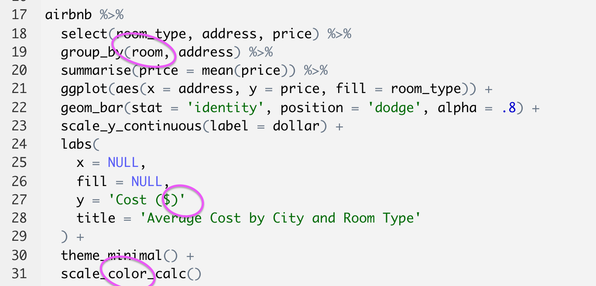

# Preamble

- Reminder: Submit 2 “stakeholder-ready” data visualizations on November 11 or before
- How do you clean up your RStudio environment?
  - `rm()`
- When I aggregate my data, it always says: "`summarise() has grouped output by [SOME_VARIABLE]. You can override using the .groups argument`." What does that mean?
  - grouping and ungrouping
- Errors: good or bad?

```{r setup, include=FALSE}
library(tidyverse)
library(knitr)
library(countdown)
library(kableExtra)
library(formatR)
library(scales)
library(ggthemes)
options(scipen=999)

opts_chunk$set(warning=FALSE, message=FALSE)

airbnb <- read_csv('https://bit.ly/3oadz2L', col_types = cols())
climate <- read_csv('https://bit.ly/3kKErEb', col_types = cols())
checkin <- read_csv('https://bit.ly/3nQHlI0', col_types = cols())
```

---

# Preamble

What does "Stakeholder-ready" mean?
- Write a plot title
- Label the axes 
- Use a theme
- Do not include `NA`s in the plot (geom or legend)  

Other things to do when you submit your assignment
- Use `ggsave()` to export plots
- When you submit your assignment, submit your code and both plots

---

# What we learned in the previous class

- Overview of ggplot2  
- Building bar, line, scatter, and histogram plots  
  - Aggregated data
  - Disaggregated data
- Customizing plots

---

# What we'll learn today  

- More ways to use logical conditions for filtering and changing variable values
- How to "pivot" data, turning columns into rows and rows into columns
- How to merge two datasets
- Creating panels of plots with facets
- Counting cumulatively with `cumsum()`

---

# A reminder on troubleshooting

- Run code line by line  
- Ensure the code finished running (`+`s vs. `>`s in the R console)  
- Red "x" annotation beside line numbers (after saving your file)


---

# Troubleshooting exercise 

This code contains 4 mistakes. The code is supposed to create a plot of rentals by latitude and longitude, excluding rentals without ratings. The colors of points should be from the high charts color palette (`hc`). *HINT: It is possible to successfully produce the plot after correcting 3 mistakes, but the colors of the points will be from the default colors palette, not from the high charts palette. Why?*  

```r
library(tidyverse)
library(ggthemes)
        
airbnb <- read_csv('https://bit.ly/3oadz2L')

airbnb %>% 
  filter(! is.na(rating) %>% 
  ggplot(aes(x = longitude, y = latitude, color = adress)) + 
  geom_point(alpha = .6) + 
  scale_fill_hc() + 
  theme_bw() 
  labs(
    x = 'Longitude'
    , y = 'Latitude'
    , color = 'City'
    , title = 'Coordinates of Seattle-area Airbnbs'
  )
```

```{r, echo = FALSE}
countdown(minutes = 5, seconds = 0)
```

---

# Troubleshooting exercise 

This code contains 4 mistakes. The code is supposed to create a plot of rentals by latitude and longitude, excluding rentals without ratings. The colors of points should be from the high charts color palette (`hc`). *HINT: It is possible to successfully produce the plot after correcting 3 mistakes, but the colors of the points will be from the default colors palette, not from the high charts palette. Why?*  



---
class: inverse, middle, center

# More on writing logical conditions

---

# More on writing logical conditions

`ifelse()`  
- A logical test with a true-or-false outcome
- To make comparisons use: `==`, `<`, `<=`, `>`, `>=`, `!=`, `%in%`, `!`, `is.na()`
- Concatenate values with `c()`

--

...`ifelse()` is really powerful, but what do you do if there are more than two possible outcomes?

--

<br><br>
...we use `case_when()`
- *n* conditions result in *n* outcomes

---

# More on writing logical conditions

`case_when()` is similar to `ifelse()` in some ways, but differences abound.

```r
airbnb %>% mutate(expensive = ifelse(price > 100, 'y', NA))
airbnb %>% mutate(expensive = case_when(price > 100 ~ 'y'))
```

--

`case_when()`
- No `FALSE` outcome exists,  always a two-sided formulae
  - left-hand side (LHS) and right-hand side (RHS)
  - Note the use of `~` above to separate LHS and RHS
- All RHS values must be the same type (or class)
  - `NA_character_`, `NA_integer_`, `NA_real_`
- Order of conditions matters if conditions are not mutually exclusive
- A default case of `TRUE ~ NA` is used for all conditions not stated

---

# More on writing logical conditions

`case_when()`
- No `FALSE` outcome exists,  always a two-sided formulae
  - left-hand side (LHS) and right-hand side (RHS)
  - Note the use of `~` above to separate LHS and RHS

```r
airbnb %>% 
  mutate(
    price_cat = case_when(price < 100                  ~ 'low' # first formula
                          , price >= 100 & price < 200 ~ 'mid' # second formula
                          , price >= 200               ~ 'high') # third formula
  )
```

---

# More on writing logical conditions

`case_when()`
- All RHS values must be the same type (or class)
  - `NA_character_`, `NA_integer_`, `NA_real_`


**This will not work**
```r
airbnb %>% 
  mutate(
    priv_share = case_when(room_type %in% c('Private room', 'Shared room') ~ price
                          , room_type == 'Entire home/apt' ~ NA
                          )
    )
```

**This will work**
```r
airbnb %>% 
  mutate(
    priv_share = case_when(room_type %in% c('Private room', 'Shared room') ~ price
                          , room_type == 'Entire home/apt' ~ NA_real_
                          )
    )
```

---

# More on writing logical conditions

`case_when()`
- Order of conditions matters if conditions are not mutually exclusive
- A default case of `TRUE ~ NA` is used for all conditions not stated

```r
airbnb %>% 
  head(2) %>% 
  select(room_id, host_id, rating, accommodates, price) %>% 
  mutate(
    category = case_when(rating == 5 ~ 'High rating'
                        , accommodates >= 6 ~ 'Big!'
                        , price >= 200 ~ 'Expensive'
                        )
    )
```

---

# More on writing logical conditions

.pull-left[
With the `airbnb` data, create a bar plot that shows counts of three different home size categories. 
- Begin by creating a new variable called `home_size`
- `home_size` values should be `"Small"` (two bedrooms or fewer), `"Medium"` (three or four bedrooms), and `"Large"` (more than four bedrooms)
- Only show `Entire home/apt` rentals
- HINT: you can build this plot with aggregated or disaggregated data
  - Disaggregated is easier
- Update the plot aesthetic, plot title, axis titles, etc. if you'd like
]

.pull-right[
```{r, dpi = 300, fig.height = 4, echo = FALSE, warning=FALSE, message=FALSE}
airbnb %>% 
  mutate(
    home_size = case_when(bedrooms <= 2 ~ 'Small'
                          , bedrooms %in% 3:4 ~ 'Medium'
                          , bedrooms > 4 ~ 'Large')
  ) %>% 
  filter(room_type == 'Entire home/apt') %>% 
  ggplot(aes(x = home_size)) +
  geom_bar(fill = 'orange') + 
  scale_y_continuous(labels = comma) + 
  theme_hc() + 
  labs(x = 'Home Size', y = 'Number of Homes')
```
]

```{r, echo = FALSE}
countdown(minutes = 10, seconds = 0)
```

---

# More on writing logical conditions

```r
airbnb %>% 
  mutate(
    home_size = case_when(bedrooms <= 2 ~ 'Small'
                          , bedrooms %in% 3:4 ~ 'Medium'
                          , bedrooms > 4 ~ 'Large')
  ) %>% 
  filter(room_type == 'Entire home/apt') %>% 
  ggplot(aes(x = home_size)) +
  geom_bar(fill = 'orange') + 
  scale_y_continuous(labels = comma) + 
  theme_hc() + 
  labs(x = 'Home Size', y = 'Number of Homes')
```

---

# More on writing logical conditions

`ifelse()`  
- A logical test with a true-or-false outcome
- To make comparisons use: `==`, `<`, `<=`, `>`, `>=`, `!=`, `%in%`, `!`, `is.na()`
- **Or use `str_detect()` to search for patterns over strings**

`str_detect()` has three arguments
- `string`, where you are searching for the pattern
- `pattern`, the pattern to look for
- `negate`, whether you want to return matches or non-matches 

```{r, echo = TRUE, collapse=TRUE}
california <- c('San Francisco', 'Los Angeles', 'San Diego')

ifelse(str_detect(california, 'San'), 'yes', 'no')
```

---

# More on writing logical conditions

`ifelse()`  
- A logical test with a true-or-false outcome
- To make comparisons use: `==`, `<`, `<=`, `>`, `>=`, `!=`, `%in%`, `!`, `is.na()`
- **Or use `str_detect()` to search for patterns over strings**

`str_detect()` has three arguments
- `string`, where you are searching for the pattern
- `pattern`, the pattern to look for
- `negate`, whether you want to return matches or non-matches 

```r
airbnb %>% 
  transmute(
    room_id
    , reviews
    , price
    , cozy = ifelse(str_detect(name, 'cozy'), 'so cozy', 'not so cozy')
    )
```

---

# More on writing logical conditions

`str_detect()` + `tolower()`  
- Casing becomes a problem when searching over strings
- `tolower()` solves that problem

```r
airbnb %>% 
  transmute(
    room_id
    , reviews
    , price
    , urban_1 = ifelse(str_detect(name, 'urban'), 'so urban', 'not so urban')
    , urban_2 = ifelse(str_detect(tolower(name), 'urban'), 'so urban', 'not so urban')
    )
```

---

# More on writing logical conditions

Use `str_detect()` with `ifelse()`, `case_when()`, or `filter()`

```r
airbnb %>% 
  filter(str_detect(name, 'Cozy'))
```

-- 

Use multiple conditions to subset your data with `filter()`

```r
airbnb %>% 
  filter(str_detect(name, 'Cozy') & str_detect(name, 'Quiet'))

airbnb %>% 
  filter(str_detect(name, 'Cozy') | str_detect(name, 'Quiet'))
```


---

# More on writing logical conditions

.pull-left[
Build on your code you from the previous exercise. Create a new variable that you can use to color bar segments, making your bar plot a stacked bar plot. 
- Name the new variable `home_category`
- `home_category` should include the following values: `"Lake"` (where any `name` value contain the word `"lake"`), `"Historic"` (where any `name` value contain the word `"historic"`), `"Modern"` (where any `name` value contain the word `"modern"`)  
- Remember that `case_when()` will set `home_category` to `NA` if cases for `"Lake"`, `"Historic"`, or `"Modern"` are not met
- Exclude rentals with `NA` `home_category` values from your plot. 
]

.pull-right[
```{r, dpi = 300, fig.height = 4, fig.width = 7, echo = FALSE, warning=FALSE, message=FALSE}
airbnb %>% 
  mutate(
    home_size = case_when(bedrooms <= 2 ~ 'Small'
                          , bedrooms %in% 3:4 ~ 'Medium'
                          , bedrooms > 4 ~ 'Large')
    , home_category = case_when(str_detect(tolower(name), 'lake') ~ 'Lake'
                                , str_detect(tolower(name), 'historic') ~ 'Historic'
                                , str_detect(tolower(name), 'modern') ~ 'Modern')
  ) %>% 
  filter(room_type == 'Entire home/apt' & ! is.na(home_category)) %>% 
  ggplot(aes(x = home_size, fill = home_category)) +
  geom_bar() + 
  theme_hc() + 
  scale_fill_hc() + 
  labs(x = 'Home Size', y = 'Number of Homes', title = 'New Plot', fill = element_blank()) + 
  theme(legend.position = 'top')
```

```{r, dpi = 300, fig.height = 4, fig.width = 7, echo = FALSE, warning=FALSE, message=FALSE}
airbnb %>% 
  mutate(home_size = case_when(bedrooms <= 2 ~ 'Small'
                               , bedrooms %in% 3:4 ~ 'Medium'
                               , bedrooms > 4 ~ 'Large')
  ) %>% 
  filter(room_type == 'Entire home/apt') %>% 
  ggplot(aes(x = home_size)) +
  geom_bar(fill = 'orange') + 
  scale_y_continuous(labels = comma) + 
  theme_hc() + 
  labs(x = 'Home Size', y = 'Number of Homes', title = 'Old Plot')
```
]

```{r, echo = FALSE}
countdown(minutes = 7, seconds = 0)
```

---

# More on writing logical conditions

```r
airbnb %>% 
  mutate(
    home_size = case_when(bedrooms <= 2 ~ 'Small'
                          , bedrooms %in% 3:4 ~ 'Medium'
                          , bedrooms > 4 ~ 'Large')
    , home_category = case_when(str_detect(tolower(name), 'lake') ~ 'Lake'
                                , str_detect(tolower(name), 'historic') ~ 'Historic'
                                , str_detect(tolower(name), 'modern') ~ 'Modern')
  ) %>% 
  filter(room_type == 'Entire home/apt' & ! is.na(home_category)) %>% 
  ggplot(aes(x = home_size, fill = home_category)) +
  geom_bar() + 
  theme_hc() + 
  scale_fill_hc() + 
  labs(
    x = 'Home Size'
    , y = 'Number of Homes'
    , fill = element_blank()
    ) + 
  theme(legend.position = 'top')
```

---
class: inverse, middle, center

# Pivoting data

---

# Pivoting data

- `pivot_wider()` and `pivot_longer()` are the functions we use to reshape data
- Reshape means to turn...
  - Rows into columns (with `pivot_wider()`), so the new dataset is wider and has fewer rows than the old dataset
  - Columns into rows (with `pivot_longer()`), so the new dataset is narrower, has more rows, and fewer columns than the old dataset
  


---

# Pivoting data 

- `pivot_wider()` and `pivot_longer()` are the functions we use to reshape data
- Reshape means to turn...
  - Rows into columns (with `pivot_wider()`), so the new dataset is wider and has fewer rows than the old dataset
  - Columns into rows (with `pivot_longer()`), so the new dataset is narrower, has more rows, and fewer columns than the old dataset
  


---

# Pivoting data 

`pivot_wider()`
- Turn rows into columns
  - Data may be *easier to read* when denormalized (or are in a wider format)
  - Useful format when reporting + useful setting up calculations in specific situations
- 3 arguments
  - `data`, your tibble  
  - `names_from`, name of column that contains the names of the new columns
  - `values_from`, name of columns that contains the values of the new columns

```r
airbnb %>% 
  group_by(address, room_type) %>% 
  summarise(number_of_rentals = n(), .groups = 'drop') %>% 
  pivot_wider(names_from = room_type, values_from = number_of_rentals)
```

--

```r
airbnb %>% 
  group_by(address, room_type) %>% 
  summarise(number_of_rentals = n(), .groups = 'drop') %>% 
  pivot_wider(names_from = room_type, values_from = number_of_rentals) %>%
  mutate(private_or_shared = `Private room` + `Shared room`)
```

---

# Pivoting data 
`pivot_longer()`
- Turn columns into rows
- Often "metrics" are *easier to analyze* when stored in only one column
- 4 arguments
  - `data`, Your tibble 
  - `cols`, which columns you want turn into rows
  - `names_to`, name of column for column names
  - `values_to`, name of column for values in columns
  
```r
airbnb %>% 
  select(room_id, host_id, room_type, address, reviews, rating) %>% 
  pivot_longer(
    cols = c(reviews, rating)
    , names_to = 'rental_characteristics'
    , values_to = 'values'
    )
  
```

---

# Pivoting data 

Complete either Exercise #1 or #2 in 10 minutes. You pick.

**Exercise #1**: With the `climate` data, report the mean temperatures for `"Angola"`, `"Ivory Coast"`, `"Ethiopia"`
, and `"Kenya"` in the years `1850`, `1900`, `1950`, and `2000`
- There should be one row per country
- You should pivot the data so the years are columns like in the example below
- In this exercise you will use `filter()`, `group_by()`, `summarise()`, and `pivot_wider()`

**Exercise #2**: With the `airbnb` data, create a bar plot that shows the average number of bathrooms and bedrooms by room type.
- In this exercise you will use `group_by()`, `summarise()`, and `pivot_longer()`
- To create the plot, you will have a `y` variable; therefore `stat = 'identity'`
- The `names_to` variable you create with `pivot_longer()` should be the variable you use to color the bars and the bars should be unstacked (`position = 'dodge'`)
- Update plot aesthetics as you'd like

```{r, echo = FALSE}
countdown(minutes = 10, seconds = 0, top = 0)
```

---

# Pivoting data 

.pull-left[

**Exercise #1 hint**
```{r, echo = FALSE, warning=FALSE, message=FALSE}
climate %>% 
  filter(
    country %in% c('Angola', 'Ivory Coast', 'Ethiopia', 'Kenya') 
    & year %in% c(1850, 1900, 1950, 2000)
  ) %>% 
  group_by(country, year) %>% 
  summarise(temp = mean(temp), .groups = 'drop') %>% 
  pivot_wider(names_from = year, values_from = temp) %>% 
  mutate(across(.cols = ! contains('country'), ~ case_when(is.numeric(.x) ~ '-'))) %>% 
  as.data.frame
```
]

.pull-right[
**Exercise #2 hint**

```{r, dpi = 300, echo = FALSE, warning=FALSE, message=FALSE}
airbnb %>% 
  pivot_longer(c(bedrooms, bathrooms), names_to = 'characteristic', values_to = 'count') %>% 
  group_by(room_type, characteristic) %>% 
  summarise(mean_count = mean(count, na.rm = TRUE)) %>% 
  ggplot(aes(x = room_type, y = mean_count, fill = characteristic)) + 
  geom_bar(stat = 'identity', position = 'dodge') + 
  theme_bw() + 
  scale_fill_fivethirtyeight() + 
  labs(x = element_blank(), y = 'Average Count', fill = element_blank())
```
]

---

# Pivoting data 

**Exercise #1**
```r
climate %>% 
  filter(
    country %in% c('Angola', 'Ivory Coast', 'Ethiopia', 'Kenya') 
    & year %in% c(1850, 1900, 1950, 2000)
  ) %>% 
  group_by(country, year) %>% 
  summarise(temp = mean(temp), .groups = 'drop') %>% 
  pivot_wider(names_from = year, values_from = temp, names_sort = TRUE)
```

---

# Pivoting data 

**Exercise #2**
```r
airbnb %>% 
  pivot_longer(
    cols = c(bedrooms, bathrooms)
    , names_to = 'characteristic'
    , values_to = 'count'
    ) %>% 
  group_by(room_type, characteristic) %>% 
  summarise(mean_count = mean(count, na.rm = TRUE), .groups = 'drop') %>% 
  ggplot(aes(x = room_type, y = mean_count, fill = characteristic)) + 
  geom_bar(stat = 'identity', position = 'dodge') + 
  theme_bw() + 
  scale_fill_fivethirtyeight() + 
  labs(x = element_blank(), y = 'Average Count', fill = element_blank())
```

---
class: inverse, middle, center

# Merging tibbles

---

# Merging tibbles

- Merge tibbles with `left_join()`, `inner_join()`, `right_join()`, and `full_join()`
- Used to...
  - Merge data from multiple sources
  - Filter
- Arguments
  - `x`, left tibble
  - `y`, right tibble
  - `by`, keys used to "link" or merge tibbles

--


---

# Merging tibbles

- Merge tibbles with `left_join()`, `inner_join()`, `right_join()`, and `full_join()`
- Used to...
  - Merge data from multiple sources
  - Filter
- Arguments
  - `x`, left tibble
  - `y`, right tibble
  - `by`, keys used to "link" or merge tibbles

`left_join()`
- all `x` rows, matching `y` rows

```r
checkin <- read_csv('https://bit.ly/3nQHlI0')

airbnb %>% 
  filter(room_id %in% c(10209, 5682, 9596)) %>% 
  select(room_id, host_id, address) %>% 
  left_join(checkin, by = 'room_id')
```

---

# Merging tibbles

`inner_join()`
- matching `x` rows, matching `y` rows

```r
airbnb %>% 
  select(room_id, host_id, address) %>% 
  inner_join(checkin, by = 'room_id') %>% 
  filter(room_id %in% c(5682, 99999999))
```

`right_join()`
- matching `x` rows, all `y` rows

```r
airbnb %>% 
  select(room_id, host_id, address) %>% 
  right_join(
    checkin %>% 
      filter(room_id %in% c(10209, 99999999))
    , by = 'room_id'
    )
```

---

# Merging tibbles

`full_join()`
- all `x` rows, all `y` rows

```r
airbnb %>% 
  filter(room_id %in% c(10209, 5682)) %>% 
  select(room_id, host_id, address) %>% 
  full_join(
    checkin %>% 
      filter(room_id %in% c(10209, 99999999))
    , by = 'room_id'
    )
```

---

# Merging tibbles

Create a line plot that shows number of check-ins over time. There should be a line for each `address` value.
- Merge `airbnb` and `checkin`
- You can use aggregated (with `group_by()` and `summarise()`) or disaggregated data (make sure `stat = 'identity'`) to create the plot

If you build the plot without `group_by()` and `summaris()`, use `left_join()`, `inner_join()`, and `right_join()` and look at any warning messages that appear when you build the plot. What are they telling you?

```{r, echo = FALSE}
countdown(minutes = 7, seconds = 0)
```

```{r, dpi = 300, echo = FALSE, fig.height = 3.5, fig.width = 4, warning=FALSE, message=FALSE}
airbnb %>% 
  left_join(checkin, by = 'room_id') %>% 
  ggplot(aes(x = check_in_date, color = address)) + 
  geom_line(stat = 'count', size = 1) + 
  theme_bw() + 
  scale_color_few() + 
  labs(
    x = 'Check-in Date'
    , y = 'Number of Check-ins (#)'
    , color = element_blank()
  )
```


